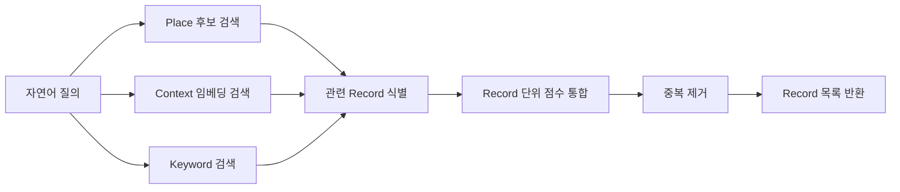

# PinLog AI 설계

## 1. 목적

AI 자연어 검색은 사용자가 정확한 Place 이름을 기억하지 못해도 저장 당시의 Context와 Keyword로 자신의 Record를 찾게 합니다.

기능 명칭은 구현 기술과 관계없이 `AI 자연어 검색`으로 통일합니다.

## 2. 검색 범위

현재 로그인한 User의 데이터만 검색합니다.

- Place 이름, 주소, 카테고리, 지역 정보
- Context 원문
- Keyword와 Keyword 검색 표현

다른 사용자의 Context와 Collection은 검색하지 않습니다.

## 3. 처리 흐름



검색 결과에는 소유자 기준 Place, Context, Keyword, Record 생성일을 표시할 수 있습니다. 선택 이유 문구는 제공하지 않습니다.

## 4. Keyword 생성

Keyword는 Place와 Context를 분석하여 서비스가 정의한 프리셋에서 매핑합니다.

비식별화 대상:

- 사람 이름
- 구체적인 회사명·학교명
- 정확한 개인 일정과 날짜
- 사용자를 특정할 수 있는 사건

일반적인 관계 표현은 유지할 수 있습니다.

## 5. 임베딩 처리

| 이벤트 | 처리 |
|---|---|
| Context 생성 | 새 Context 임베딩 생성 |
| Context 수정 | 수정 Context 임베딩 재생성 |
| Record 삭제 | 관련 임베딩을 검색 대상에서 제외 |
| Record 재생성 | 활성 Context 전체와 Keyword 검색 표현을 새 Record 기준으로 재생성 |

Record 재생성 흐름:

```text
새 Record 생성
→ 활성 Context 연결
→ Collection 연결 승계
→ Context 전체 재임베딩
→ Keyword 검색 표현 재생성
→ 새 Record 활성화
```

불완전한 새 Record가 검색이나 Feed에 노출되지 않도록 Record 활성화 전에 Context, Collection 연결, Keyword 관계, 임베딩이 완료되어야 합니다.

## 6. MVP 구현 범위

- Place·Context·Keyword 검색
- Record 단위 점수 통합과 중복 제거
- 개인 데이터 범위 검색
- Context 생성·수정 및 Record 재생성에 따른 임베딩 처리
- 검색 결과 없음 처리

## 7. Future

GraphRAG는 MVP에 포함하지 않습니다.

향후 검토할 수 있는 범위:

- Record, Place, Keyword, Collection 관계를 검색 증강에 활용
- 관계형 DB와 벡터 검색에 그래프 탐색 결합
- 과거 경험, 현재 관심, 미래 계획의 관계 기반 탐색

Future 항목은 현재 구현 정책이나 확정 기술을 의미하지 않습니다.
