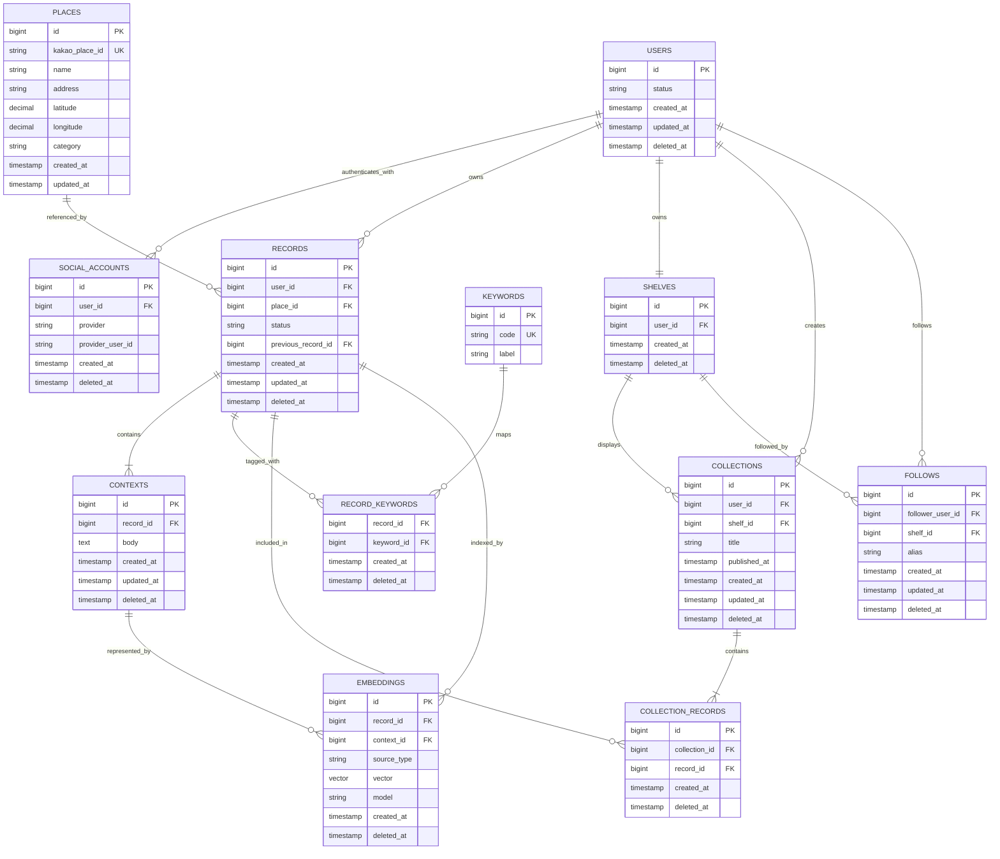

# PinLog ERD

## 핵심 제약

- `social_accounts`: `UNIQUE(provider, provider_user_id)`
- `places`: `UNIQUE(kakao_place_id)`
- `records`: 활성 상태 기준 `UNIQUE(user_id, place_id)`
- `shelves`: `UNIQUE(user_id)`
- `collection_records`: 활성 상태 기준 `UNIQUE(collection_id, record_id)`
- `follows`: 활성 상태 기준 `UNIQUE(follower_user_id, shelf_id)`
- Record는 Context를 1개 이상, Collection은 Record를 1개 이상 가져야 합니다.
