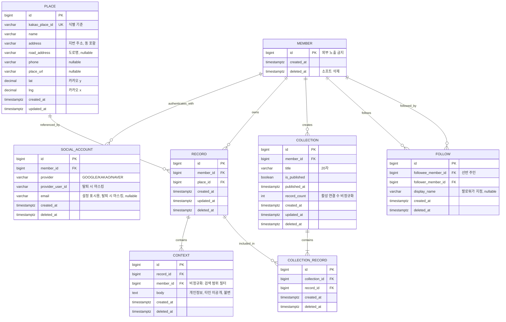
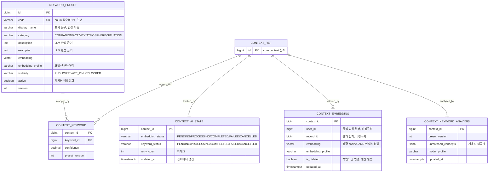

# PinLog ERD

DBMS는 PostgreSQL이며, 스키마는 `core`(백엔드 소유)와 `ai`(AI 파트 소유)로 분리합니다. 동일 인스턴스이므로 크로스 스키마 조인이 가능합니다.

Core 테이블의 상세 정의와 근거는 [데이터 모델 및 무결성](06_데이터모델_및_무결성.md)을, `ai` 스키마의 의미와 상태 계약은 [AI 설계](../static/05_AI_설계.md)를 따릅니다.

## 1. core 스키마

## 2. ai 스키마

AI 파트 소유입니다. 상세 의미와 상태 계약은 [AI 설계](../static/05_AI_설계.md)를 따릅니다.

백엔드는 `context_keyword`와 `keyword_preset`을 읽기 조인하며, 쓰기는 `context_ai_state`의 PENDING·CANCELLED 전이와 `context_embedding.is_deleted`로 한정합니다. AI 워커는 `core` 스키마에 접근하지 않습니다.

`CONTEXT_REF`는 다이어그램 표현을 위한 `core.context` 참조이며 실제 테이블이 아닙니다. `core`와 `ai` 사이에 물리 FK를 강제하지 않으며, `context_keyword → keyword_preset` FK만 유지할 수 있습니다.

처리 상태를 `context_embedding`이 아니라 `context_ai_state`가 별도로 가지는 이유는 `embedding_status`와 `keyword_status`가 독립적으로 전이해야 하기 때문입니다. 임베딩만 성공한 상태에서 키워드 단계만 재개하는 부분 재개가 여기에 의존합니다.

파이프라인 처리 단위는 Context입니다. Context가 불변이고 작업이 Context 단위로 격리되므로, 완료 순서가 뒤바뀌어도 서로의 결과를 덮어쓰지 않습니다. 따라서 버전 컬럼을 두지 않습니다. 처리 중 Context가 삭제·수정되는 경합은 `context_ai_state`의 `CANCELLED`가 방어하며, FastAPI는 저장 직전 자기 스키마의 상태만 확인하고 `core.*`에 접근하지 않습니다.

## 2.1 Context 불변성

`context`는 불변 테이블입니다. `body`를 in-place로 UPDATE하지 않으며, 본문이 바뀌면 기존 행을 소프트 삭제하고 새 행을 INSERT합니다(새 `id` 발급). 그래서 `context`와 `ai` 스키마 어디에도 본문 버전 컬럼을 두지 않습니다. `context_id`가 곧 본문의 정체성이므로 동일 id 안에서 구버전과 신버전이 공존하지 않고, stale 결과 차단은 `context_ai_state`의 `CANCELLED`가 담당합니다. `ai`의 네 테이블은 모두 `context_id`를 키로 사용하며 `context_keyword`만 `(context_id, keyword_id)` 복합 키입니다.

## 3. 물리 테이블이 아닌 개념

| 도메인 용어 | 물리 표현 |
|---|---|
| Shelf(선반) | `collection.member_id`로 그룹핑한 조회 결과 |
| Library(라이브러리) | 내 Collection + 팔로우한 Shelf의 Collection을 모은 조회 결과 |
| Record Keyword | `ai.context_keyword`를 Record 단위로 집계한 파생값 |
| Collection Keyword | Record Keyword를 Collection 단위로 집계한 파생값 |

Shelf는 User와 1:1이면서 고유 속성이 없으므로 테이블로 두지 않습니다. 선반 이름은 선반이 아니라 팔로우 관계(`follow.display_name`)에 속합니다.

Keyword는 Context 단위로만 저장합니다. Record 단위로 저장하면 Context 수정·삭제 시 어느 Keyword를 제거할지 판별할 수 없습니다.

## 4. 핵심 제약

### 4.1 유니크

삭제 정책이 "소프트 삭제 + 복구 없이 새 INSERT"이므로, `place`를 제외한 모든 유니크는 **활성행 기준 부분 유니크 인덱스**입니다.

| 테이블 | 제약 | 범위 |
|---|---|---|
| `place` | `UNIQUE(kakao_place_id)` | 전체 |
| `social_account` | `UNIQUE(provider, provider_user_id)` | `WHERE deleted_at IS NULL` |
| `record` | `UNIQUE(member_id, place_id)` | `WHERE deleted_at IS NULL` |
| `collection_record` | `UNIQUE(collection_id, record_id)` | `WHERE deleted_at IS NULL` |
| `follow` | `UNIQUE(followee_member_id, follower_member_id)` | `WHERE deleted_at IS NULL` |

전체 유니크로 정의하면 삭제 후 재저장이 실패합니다.

### 4.2 CHECK

| 테이블 | 제약 |
|---|---|
| `follow` | `followee_member_id <> follower_member_id` (자기 팔로우 금지) |
| `context` | `length(btrim(body)) > 0` |
| `collection` | `length(btrim(title)) > 0`, `record_count >= 0` |
| `place` | `lat BETWEEN -90 AND 90`, `lng BETWEEN -180 AND 180` |

### 4.3 애플리케이션 보장

DB 제약으로 표현할 수 없어 서비스 트랜잭션과 행 잠금으로 보장합니다.

- 활성 Record는 활성 Context를 1개 이상 가집니다. 마지막 Context 삭제 요청은 409로 거절하고, 프론트 확인 후 Record 강제 삭제로 처리합니다.
- 활성 Collection은 활성 Record를 1개 이상 가집니다. 마지막 연결 제거 요청은 409로 거절하고, 프론트 확인 후 Collection 삭제로 처리합니다.
- Record 일반 삭제 시 마지막 Record인 Collection이 있으면 409로 거절합니다. 강제 삭제(`/records/{recordId}/force`)에서만 해당 Collection을 함께 삭제합니다.
- Context 수정은 추가를 먼저 하고 삭제를 나중에 수행하여 빈 Record 상태를 만들지 않습니다.
- `collection.record_count`는 연결 추가·제거와 동일 트랜잭션에서 갱신합니다.

활성 수를 세고 그 결과로 분기하는 작업은 부모 행(`record`, `collection`)을 잠근 뒤 수행합니다. 자식 행 잠금은 서로 다른 자식을 대상으로 할 때 겹치지 않아 경합을 막지 못합니다.

## 5. 삭제 방식 요약

| 대상 | 방식 |
|---|---|
| member, social_account, record, context, collection, collection_record, follow | 소프트 삭제 (`deleted_at`) |
| `ai.context_embedding` | `is_deleted = true` 표시 |
| `ai.context_ai_state` | 두 status `CANCELLED` 전이 |
| place | 삭제하지 않음 |
| keyword_preset | 삭제하지 않음 (`active` 플래그로 비활성화) |

AI 파생 데이터는 표시 즉시 검색·공개 대상에서 제외됩니다. `CANCELLED`가 진행 중인 작업을 취소하고 `is_deleted`가 검색 제외와 물리 삭제 대상 식별을 담당합니다. 물리 삭제 시점은 별도 개인정보 정책을 따릅니다.
