# PinLog 유저플로우

핵심 사용자 흐름과 각 단계의 거부 조건을 정의합니다. 데이터 처리 근거는 데이터 모델 및 무결성 문서를 따릅니다.

## 0. 공통 전제

- **선반은 화면 개념입니다.** 한 사용자의 공개 컬렉션 목록을 선반이라 부르며, 별도 생성 절차가 없습니다.
- **기록은 장소와 맥락이 함께 있어야 성립합니다.** 장소만 저장하거나 맥락 없는 기록을 만들 수 없습니다.
- **맥락 수정은 기존 맥락을 삭제하고 새 맥락을 생성하는 방식으로 처리합니다.** 사용자에게는 수정으로 보이지만 데이터는 새 맥락으로 교체되며 식별자가 바뀝니다.
- **Keyword는 비동기로 만들어집니다.** 기록과 맥락은 저장 즉시 사용할 수 있고, Keyword는 잠시 후 표시됩니다. 화면은 Keyword가 비어 있는 상태를 허용해야 합니다.
- **삭제한 것은 복구되지 않습니다.** 다시 저장하면 항상 새로 만들어집니다.
- **타인의 맥락 원문은 어떤 흐름에서도 노출되지 않습니다.** 다른 사용자에게 보이는 것은 장소와 Keyword뿐입니다.
- 사용자 신원은 어디에서도 드러나지 않습니다. 팔로우도 사람이 아니라 선반을 대상으로 합니다.

## 1. 가입과 로그인

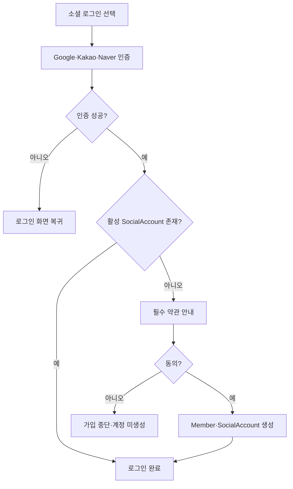

- 회원가입은 소셜 인증만으로 완료되지 않습니다. **필수 동의까지 마쳐야 계정이 생성**됩니다.
- 동의 화면에서 이탈하면 아무 데이터도 남지 않습니다. 다시 진입하면 소셜 인증부터 시작합니다.
- 탈퇴한 사용자가 같은 소셜 계정으로 로그인하면 활성 SocialAccount가 없으므로 **신규 가입 흐름**을 탑니다. 과거 데이터는 복구되지 않습니다.
- MVP는 소셜 로그인만 지원하므로 아이디 찾기, 비밀번호 찾기, 비밀번호 변경 흐름이 없습니다.
- 로그아웃은 세션 종료 후 로그인 화면으로 돌아가는 단순 흐름이므로 별도 다이어그램을 두지 않습니다.

## 2. 장소 추가와 맥락 작성

새로운 장소를 찾아 기록을 남기는 흐름입니다.

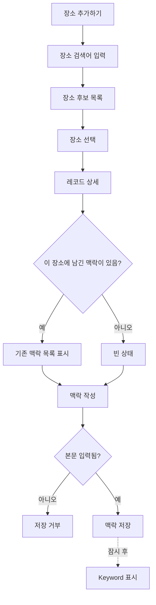

- 장소 후보는 외부 지도 서비스에서 가져옵니다. **후보를 보는 것만으로는 저장되지 않으며**, 사용자가 맥락을 실제로 남기는 시점에 내부에 저장됩니다.
- **맥락 없이 장소만 저장할 수 없습니다.** 아직 방문하지 않은 장소도 저장할 수 있지만, 가고 싶은 이유를 맥락으로 작성해야 합니다.
- 이미 맥락을 남긴 장소를 다시 선택하면 기존 맥락을 함께 보여주고, 거기에 이어서 추가할 수 있습니다. 사용자에게 중복 기록이 생기지 않습니다.
- 예전에 삭제했던 장소를 다시 저장하면 과거 기록이 되살아나지 않고 새 기록으로 시작합니다.
- Keyword는 저장 직후 잠시 비어 있을 수 있습니다.

## 3. 레코드 상세와 맥락 관리

이미 저장한 기록을 열어 맥락을 관리하는 흐름입니다. 진입점은 내 기록 목록, 검색 결과, 지도 마커입니다.

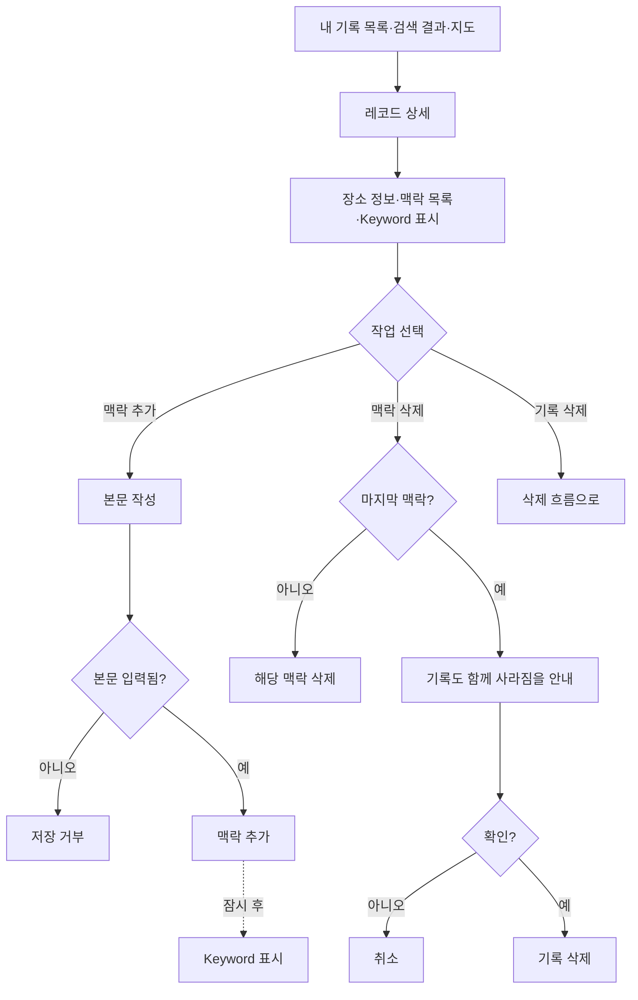

- 같은 장소에 여러 저장 이유를 남길 때는 새 기록이 아니라 **맥락을 추가**합니다.
- 맥락 수정은 **기존 맥락을 삭제하고 새 맥락을 생성하는 방식**으로 처리합니다. 사용자에게는 수정이지만 내부적으로는 새 맥락으로 교체되어 식별자가 바뀝니다.
- 빈 기록은 허용하지 않으므로, 마지막 맥락을 지우면 기록이 함께 사라집니다. 안내 후 확인을 받습니다.
- 그 기록이 어떤 컬렉션의 마지막 기록이었다면 해당 컬렉션도 함께 사라집니다. 이 사실도 같은 안내에 포함합니다.
- 맥락을 지우면 그 맥락에서 나온 Keyword만 사라집니다. 다른 맥락의 Keyword는 영향받지 않습니다.

## 4. AI 자연어 검색

내 기록을 자연어로 다시 찾는 흐름입니다. 장소를 새로 찾는 흐름(2번)과는 진입점이 분리되어 있습니다.

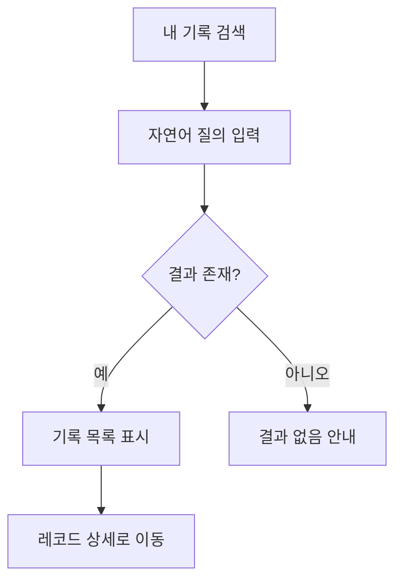

- 검색 대상은 **내가 남긴 맥락뿐**입니다. 다른 사용자의 맥락이나 컬렉션은 검색되지 않습니다.
- 장소 이름을 기억하지 못해도 저장 당시의 이유로 찾을 수 있습니다.
- 결과는 장소 단위가 아니라 **기록 단위**로 표시됩니다. 한 기록에 여러 맥락이 일치해도 목록에는 한 번만 나옵니다.
- 방금 추가한 맥락은 Keyword·임베딩 생성이 끝나기 전이라 잠시 검색되지 않을 수 있습니다.

## 5. 컬렉션 생성과 발행

제목 입력과 기록 선택을 한 화면에서 함께 진행합니다. 입력 순서는 자유입니다.

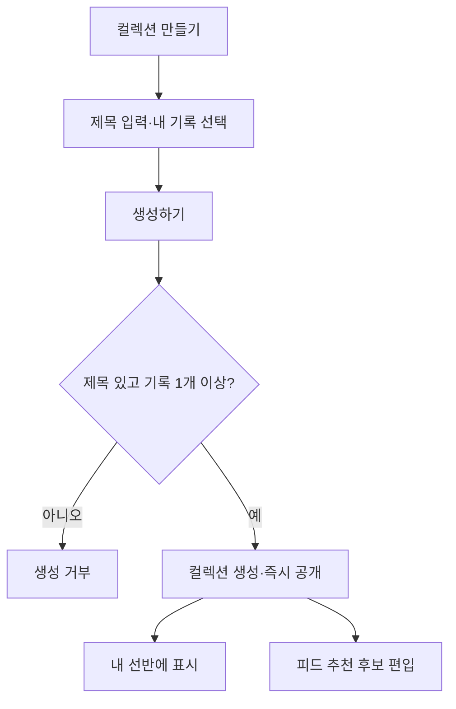

- 빈 컬렉션은 만들 수 없습니다. 기록을 최소 한 개 포함해야 합니다.
- 제목은 필수이며 20자 이내입니다.
- 생성과 동시에 공개됩니다. MVP에서는 사용자가 비공개로 전환할 수 없습니다.
- 하나의 기록은 여러 컬렉션에 담을 수 있습니다.
- 컬렉션에 담아도 기록의 맥락은 공개되지 않습니다. 다른 사용자에게는 장소와 Keyword만 보입니다.

## 6. 컬렉션 편집

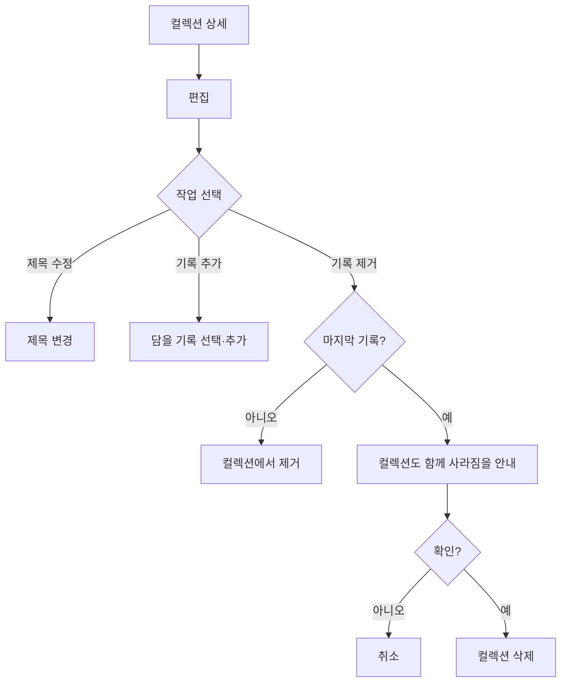

- 공개 중인 컬렉션도 수정할 수 있습니다. 별도 재발행 절차 없이 바로 반영됩니다.
- 기록 선택 화면에는 **이미 담긴 기록이 나타나지 않습니다.**
- 빈 컬렉션은 허용하지 않으므로, 마지막 기록을 빼면 컬렉션이 함께 사라집니다. 안내 후 확인을 받습니다.
- 컬렉션에서 기록을 빼도 **원본 기록은 남습니다.**
- 컬렉션 내부 순서는 **담은 순서 최신순**입니다. 나중에 추가한 기록이 먼저 표시됩니다.
- 기록을 담는 진입점은 컬렉션 쪽 하나입니다. 레코드 상세에서 컬렉션에 담는 경로는 MVP에 없습니다.

## 7. 피드 탐색과 외부 장소 가져오기

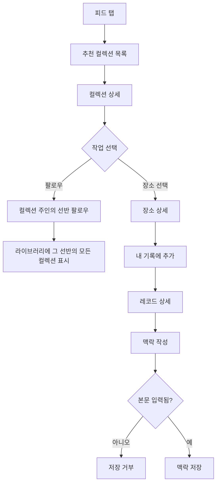

- 피드는 별도 탭이며 **다른 사용자의 공개 컬렉션**을 추천합니다. MVP의 추천 단위는 컬렉션이고, 장소 단위 추천은 후순위입니다.
- 컬렉션을 만든 사람이 누구인지는 알 수 없습니다.
- **컬렉션 하나만 따로 담아두는 기능은 없습니다.** 계속 보고 싶으면 그 컬렉션 주인의 선반을 팔로우하며, 이후 라이브러리에서 그 선반의 모든 공개 컬렉션을 확인합니다.
- 컬렉션 목록에는 제목, 담긴 장소 개수, 생성일이 표시됩니다.
- 장소 상세에서는 장소 정보와 Keyword를 볼 수 있습니다. **다른 사용자의 맥락 원문은 어디에서도 보이지 않습니다.**
- 피드에서 발견한 장소를 내 기록으로 추가할 때도 **맥락 작성이 필수**입니다. 타인의 기록을 복제하는 것이 아니라 내 기록을 새로 만드는 것입니다.
- 이미 그 장소에 내 맥락이 있으면 기존 맥락을 함께 보여주고 이어서 추가합니다.
- 삭제됐거나 만든 사람이 탈퇴한 컬렉션은 피드에 나타나지 않습니다. 이미 열어둔 화면에서 접근하면 **찾을 수 없음**으로 처리합니다.

## 8. 선반 팔로우

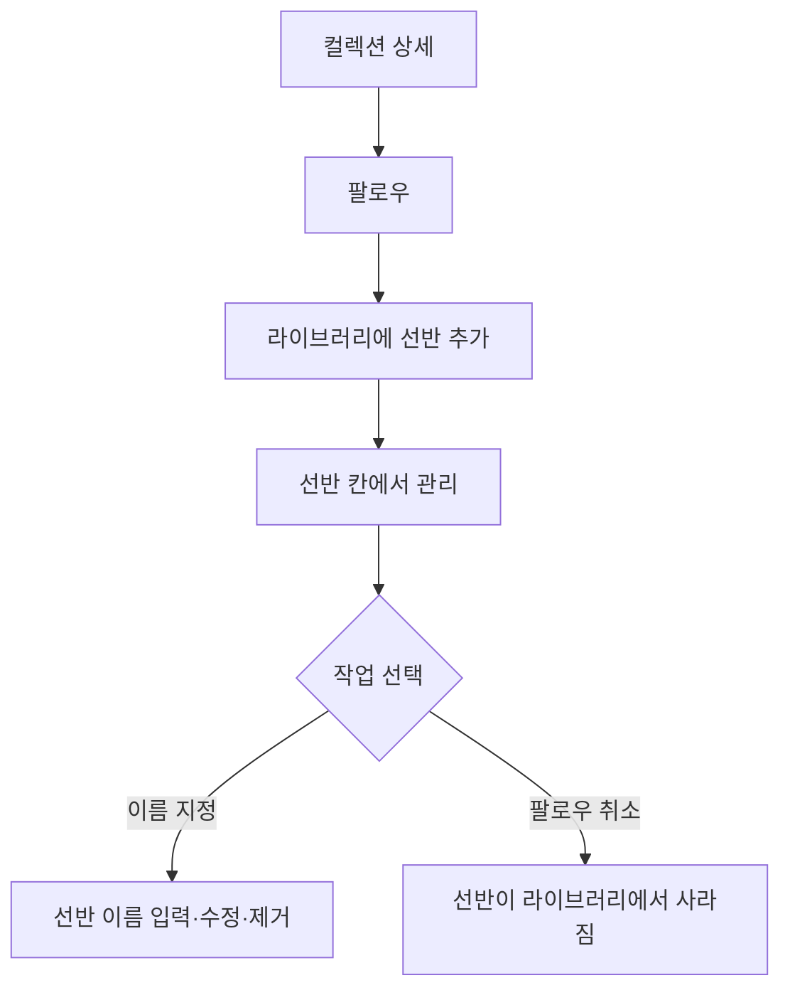

- 팔로우 대상은 개별 컬렉션이 아니라 **선반**입니다. 결과적으로 특정 사용자의 공개 컬렉션 전체를 구독하지만, 그 사람의 신원은 노출되지 않습니다.
- 자기 선반은 팔로우할 수 없고, 같은 선반을 중복 팔로우할 수 없습니다.
- **팔로우 시점에는 이름을 묻지 않습니다.** 한 번의 동작으로 팔로우가 끝나고, 이름은 나중에 라이브러리에서 원할 때 붙입니다.
- 선반 이름은 **내가 붙이는 것**입니다. 지정하지 않으면 이름 없이 컬렉션만 표시되며, 언제든 바꾸거나 지울 수 있습니다. 다른 팔로워의 화면에는 영향을 주지 않습니다.
- 팔로우 취소는 라이브러리의 해당 선반 칸에서 합니다.
- 취소하면 내가 지정했던 이름도 함께 사라집니다. 다시 팔로우해도 복원되지 않습니다.

## 9. 라이브러리 조회

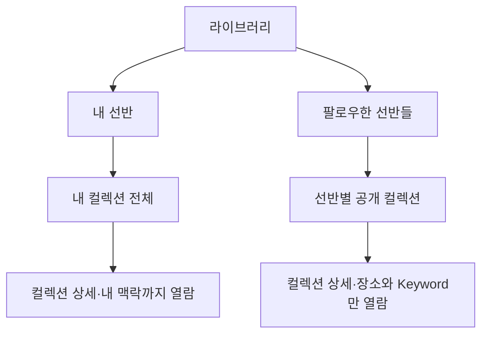

- 라이브러리는 내 선반과 팔로우한 선반들을 함께 보는 공간입니다.
- **내 선반에는 이름이 없습니다.** 팔로우한 선반에는 내가 지정한 이름이 있을 수 있습니다.
- 팔로우한 선반에는 그 사람의 **공개 컬렉션이 모두** 표시됩니다. 팔로우 이후 새로 만들어진 컬렉션도 자동으로 나타납니다.
- 내 컬렉션에서는 내 맥락을 볼 수 있지만, 팔로우한 선반의 컬렉션에서는 장소와 Keyword만 보입니다.
- 내 개인 영역에서 팔로워 수와 팔로잉 수를 확인할 수 있습니다. **목록은 제공하지 않으며, 이 수치는 본인만 볼 수 있습니다.**

## 10. 삭제 흐름

삭제는 모두 **상세 화면에서만** 가능합니다. 목록에서 바로 지우는 경로는 없습니다.

맥락 삭제는 3번, 컬렉션에서 기록 제거는 6번을 참고합니다.

### 10.1 기록 삭제

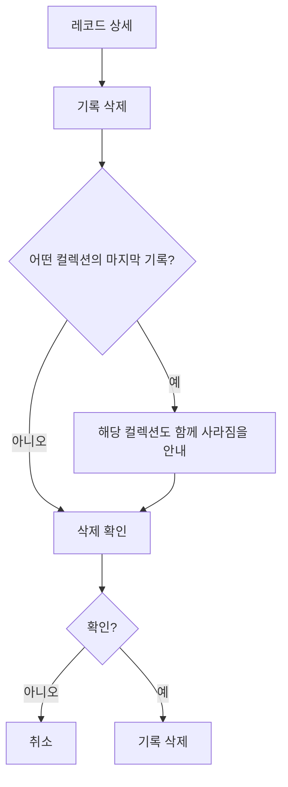

- 기록을 지우면 그 기록의 **모든 맥락이 함께 사라집니다.**
- 그 기록이 마지막이던 컬렉션은 함께 삭제됩니다. 어떤 컬렉션이 사라지는지 미리 알립니다.
- 다른 컬렉션에서는 해당 기록만 빠지고 컬렉션은 유지됩니다.
- 장소 자체는 사라지지 않습니다. 다른 사용자도 참조하는 공용 정보이기 때문입니다.
- 삭제한 기록은 복구할 수 없습니다. 같은 장소를 다시 저장하면 새 기록이 됩니다.

### 10.2 컬렉션 삭제

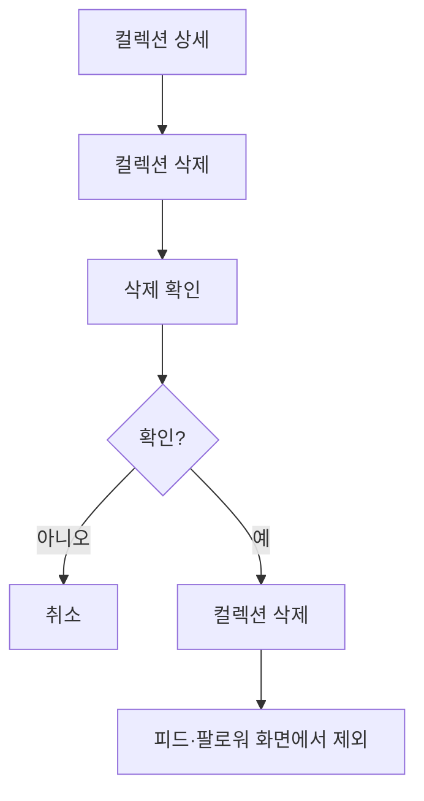

- 컬렉션을 삭제해도 **원본 기록은 남습니다.** 컬렉션과의 연결만 끊깁니다.
- 나를 팔로우한 사용자의 라이브러리에서도 즉시 사라집니다.

## 11. 회원 탈퇴

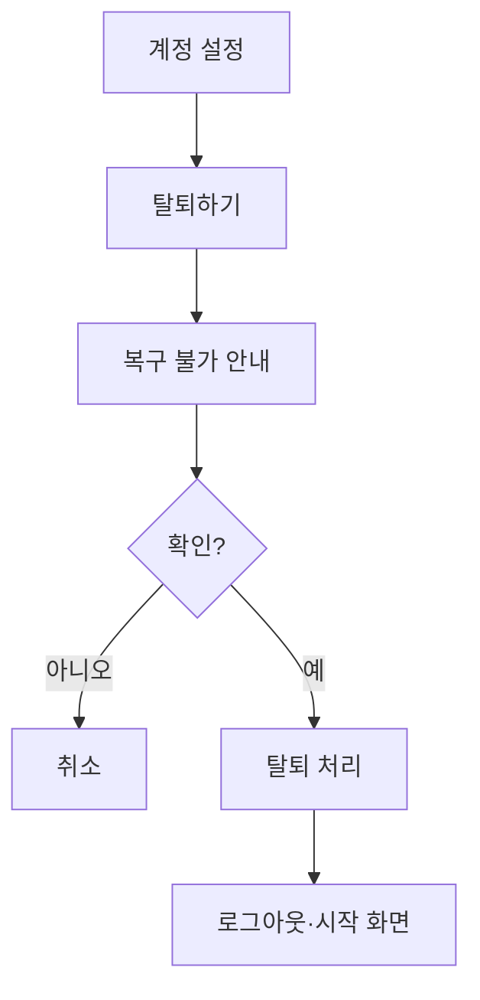

- 탈퇴하면 기록, 맥락, 컬렉션, 팔로우 관계가 모두 사라지며 **복구할 수 없습니다.**
- 나를 팔로우하던 사람의 라이브러리에서 내 선반이 사라지고, 내 컬렉션은 피드에서 즉시 제외됩니다.
- 같은 소셜 계정으로 다시 가입할 수 있지만, 과거 데이터는 되살아나지 않고 새 계정이 됩니다.
- 장소는 공용 정보이므로 남습니다.

## 12. 예외 처리 요약

### 12.1 사용자가 시도할 수 없는 것

화면에서 미리 막으므로 사용자가 요청 자체를 만들 수 없습니다.

| 상황 | 처리 |
|---|---|
| 컬렉션에 이미 담긴 기록을 또 담기 | 기록 선택 화면에 나타나지 않음 |
| 자기 선반 팔로우 | 내 컬렉션에는 팔로우 버튼이 없음 |
| 이미 팔로우한 선반 다시 팔로우 | 팔로우 상태로 표시됨 |

### 12.2 안내 후 상위 삭제로 이어지는 것

빈 기록과 빈 컬렉션을 허용하지 않기 때문에, 마지막 하나를 지우는 요청은 상위 항목 삭제가 됩니다.

| 요청 | 안내 | 결과 |
|---|---|---|
| 마지막 맥락 삭제 | 기록도 함께 사라짐 | 기록 삭제 |
| 컬렉션에서 마지막 기록 제거 | 컬렉션도 함께 사라짐 | 컬렉션 삭제 |
| 어떤 컬렉션의 마지막 기록을 삭제 | 해당 컬렉션도 함께 사라짐 | 기록·컬렉션 삭제 |

### 12.3 입력이 부족해 저장되지 않는 것

| 요청 | 조건 |
|---|---|
| 맥락 저장 | 본문이 비어 있음 |
| 컬렉션 생성 | 제목이 비어 있거나 20자 초과 |
| 컬렉션 생성 | 기록을 하나도 선택하지 않음 |
| 선반 이름 지정 | 20자 초과 |

### 12.4 접근할 수 없는 것

| 요청 | 응답 |
|---|---|
| 삭제된 컬렉션 조회 | 찾을 수 없음 |
| 만든 사람이 탈퇴한 컬렉션 조회 | 찾을 수 없음 |
| 타인의 맥락 조회 | 애초에 제공되지 않음 |

권한 없음이 아니라 **찾을 수 없음**으로 응답합니다. 권한 오류는 리소스의 존재를 알려주어 익명성을 해칩니다.
