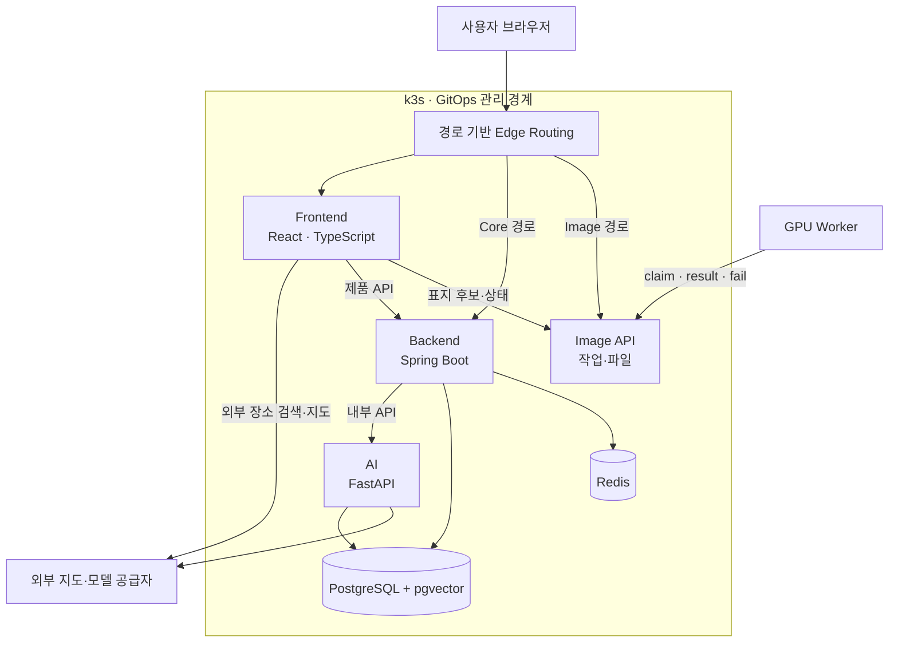
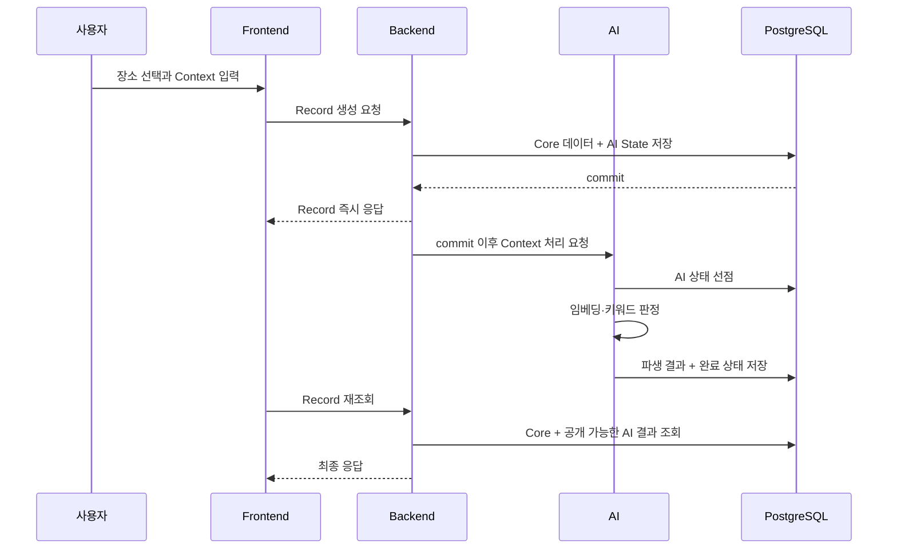
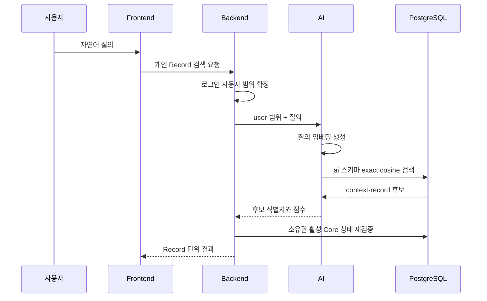
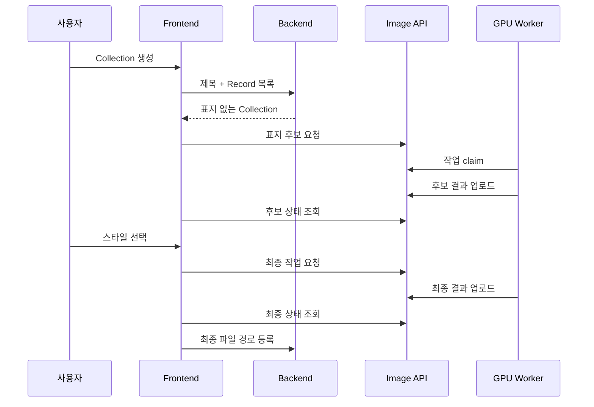

# PinLog 아키텍처

이 문서는 저장소의 공통 계약과 선언형 설정을 기준으로 구조를 재구성한다. `설계`는 문서가 의도한 계약, `선언`은 각 GitHub 저장소 설정에 적힌 원하는 상태, `당시 기록`은 특정 시점의 관측 메모를 뜻한다. 이 셋은 현재 live 상태와 같다고 보장하지 않는다.

## 1. 전체 구조

핵심은 외부 제품 요청, 내부 AI 처리, 비동기 이미지 작업을 서로 다른 계약으로 분리한 것이다. 제품 정책은 [Quick Start](../static/00_Quick_Start.md), 파트 경계는 [AI 공용 설계](../static/05_AI_설계.md), 배포 구조는 [Infra README](https://github.com/Team-PinLog/infra/blob/main/README.md)를 기준으로 한다.

## 2. 영역별 구조와 책임

### Frontend

- 현행 문서 구조는 `app`, `pages`, 도메인별 `features`, 공용 `shared`, UI용 `contexts`로 나뉜다.
- Component → Query/Mutation hook → endpoint API → 공용 HTTP client → Backend의 단방향 호출을 사용한다.
- 서버 상태는 TanStack Query, 화면 상태는 Context API로 분리한다.
- 세상의 장소 검색·지도 렌더링은 외부 지도 공급자를 직접 사용하지만, 개인 Record 검색과 자연어 검색은 Backend 계약을 사용한다.
- Image 서비스는 Core 응답 봉투와 필드 형식이 달라 전용 클라이언트 경계를 둔다.

근거: [Frontend 아키텍처](https://github.com/Team-PinLog/front/blob/dev/docs/architecture.md), [Frontend API 계약](https://github.com/Team-PinLog/front/blob/dev/docs/api-contract.md), [개인정보 규칙](https://github.com/Team-PinLog/front/blob/dev/docs/privacy-rules.md).

### Backend

- Spring 단일 앱이 외부 제품 API, 쿠키 인증, 인가, Core 도메인과 트랜잭션, 최종 응답 조립을 담당한다.
- Context 생성·교체·삭제와 AI State 초기화·취소, 재스캔과 재시도 소진 처리를 담당한다.
- Flyway 실행 주체이며 `core`와 `ai` 스키마 변경을 순서대로 적용한다.
- AI 모델 호출과 벡터 계산은 하지 않는다.
- Actuator health와 Prometheus metric endpoint를 제공하고, Kubernetes 연결은 Infra가 소유한다.

근거: [Backend README](https://github.com/Team-PinLog/back/blob/dev/README.md), [Backend 패키지 규약](https://github.com/Team-PinLog/back/blob/dev/docs/development/package-structure.md), [AI 연동 명세](https://github.com/Team-PinLog/back/blob/dev/docs/ai/spec/ai-integration.md).

### AI

- 계층은 `api → service → repository/cache/client` 한 방향이다.
- `service`만 파이프라인과 짧은 transaction 경계를 조정하고, 외부 모델 호출 중에는 DB 잠금을 유지하지 않는다.
- `repository`는 `ai` 스키마 SQL, `client`는 외부 모델, `cache`는 프리셋 스냅샷을 담당한다.
- `/internal/v1/*`만 서비스 간 계약으로 제공하며 Client가 직접 호출하지 않는다.
- 런타임 DDL을 하지 않고 Backend migration을 전제로 시작한다.

근거: [AI 아키텍처](https://github.com/Team-PinLog/ai/blob/dev/docs/spec/architecture.md), [AI 상태 머신](https://github.com/Team-PinLog/ai/blob/dev/docs/spec/state-machine.md), [AI 실패 복구](https://github.com/Team-PinLog/ai/blob/dev/docs/spec/failure-recovery.md).

### Image

- SQLite에 표지 요청·작업 상태를 저장하고 파일 디렉터리에 생성 결과를 보관하는 API다.
- 후보 작업 여러 개를 만들고, 사용자가 선택한 스타일에 대해 최종 작업을 추가한다.
- GPU worker는 보호된 claim/result/fail 경계를 사용하고 브라우저는 public API·files 경계만 사용한다.
- 저장소의 prod values는 단일 영속 볼륨과 `Recreate` 전략을 선언한다. 이는 singleton SQLite 쓰기 모델과 일치한다.

근거: [Image README](https://github.com/Team-PinLog/image/blob/feat/gpu-cover-worker-mvp/README.md), [Image TDD 기록](https://github.com/Team-PinLog/image/blob/feat/gpu-cover-worker-mvp/TDD_NOTES.md), [Image 배포 values](https://github.com/Team-PinLog/infra/blob/main/apps/prod/image/values.yaml).

### Infra

- 범용 microservice Helm chart와 환경·서비스별 values를 ApplicationSet이 발견한다.
- 서비스 Deployment는 기본적으로 non-root, 권한 상승 금지, capability 제거, 명시적 resource와 probe를 사용한다.
- PostgreSQL은 StatefulSet, Redis는 캐시·세션 서비스, Secret은 봉인된 선언으로 관리한다.
- Argo CD가 GitOps 선언을 반영하며, 런타임 직접 수정은 정상 변경 경로가 아니다.

근거: [Infra 구조](https://github.com/Team-PinLog/infra/blob/main/docs/architecture.md), [공용 Helm 값](https://github.com/Team-PinLog/infra/blob/main/charts/microservice/values.yaml), [Deployment template](https://github.com/Team-PinLog/infra/blob/main/charts/microservice/templates/deployment.yaml), [NetworkPolicy](https://github.com/Team-PinLog/infra/blob/main/docs/network-policies.md).

### Cowork

Cowork는 자연어 작업 입력을 팀 티켓 생성으로 연결하는 내부 보조 서비스이며 제품 요청 경로에 속하지 않는다. 근거: [Cowork 명세](https://github.com/Team-PinLog/cowork/blob/main/SPEC.md).

## 3. 사용자 요청 흐름

이 흐름에서 AI 실패는 Core 저장을 롤백하지 않는다. Keyword 빈 배열과 검색 반영 지연은 정상 중간 상태다. Backend Scheduler가 DB AI State를 재처리 근거로 사용한다. 근거: [AI 공용 설계](../static/05_AI_설계.md), [메시지 큐 없는 비동기 결정](https://github.com/Team-PinLog/back/blob/dev/docs/backend/decisions/BD-17-async-without-message-queue.md).

## 4. 개인 자연어 검색 흐름

AI는 요청으로 받은 사용자 범위를 검색 필터로 쓰지만 소유권을 최종 판정하지 않는다. Backend가 Core 상태와 소유권을 다시 검증한다. 개인 범위가 작은 동안 근사 벡터 인덱스보다 exact cosine을 택한 결정은 [exact cosine 결정](https://github.com/Team-PinLog/ai/blob/dev/docs/proposals/P5-exact-cosine.md)에 기록돼 있다.

## 5. Collection 표지 흐름

Collection 기본 기능은 GPU 처리에 종속되지 않는다. 표지 생성 실패·이탈 시 표지가 없는 Collection도 정상이다. 근거: [Frontend API 계약](https://github.com/Team-PinLog/front/blob/dev/docs/api-contract.md), [Image README](https://github.com/Team-PinLog/image/blob/feat/gpu-cover-worker-mvp/README.md).

## 6. 배포 흐름

```mermaid
flowchart LR
    SRC["서비스 소스 변경"]
    CI["테스트 · 빌드 · 공급망 검증"]
    IMG["Private Registry<br/>commit tag + digest"]
    VERIFY["source CI · digest 재검증"]
    PR["Infra 기능 브랜치 변경 요청"]
    CHECK["정책 · guardrail · Helm render"]
    MAIN["GitOps 기준 브랜치"]
    ARGO["Argo CD"]
    ROLL["Kubernetes rollout"]
    PROBE["startup · liveness · readiness"]
    OBS["metric · log · alert"]

    SRC --> CI --> IMG --> VERIFY --> PR --> CHECK --> MAIN --> ARGO --> ROLL --> PROBE --> OBS
```

이미지 태그만 신뢰하지 않고 digest를 함께 고정하며, 서비스별 공급망 credential과 클러스터 pull credential을 분리한다. Infra 기준 브랜치 직접 변경 대신 기능 브랜치·검증·병합을 거친다. 근거: [Git/CI 거버넌스](https://github.com/Team-PinLog/infra/blob/main/docs/git-governance.md), [Backend 이미지 빌드 결정](https://github.com/Team-PinLog/back/blob/dev/docs/backend/decisions/BD-44-image-takes-prebuilt-jar.md).

## 7. 데이터 구조와 소유권

| 저장소 | 소유자 | 내용 | 변경 경계 |
|---|---|---|---|
| PostgreSQL `core` | Backend | User, Place, Record, Context, Collection, Follow 등 | Backend transaction + Flyway |
| PostgreSQL `ai` | 계약은 공동, migration은 Backend, 런타임 파생 쓰기는 AI | AI State, Context embedding, Context keyword, preset | Flyway + 제한된 runtime 권한 |
| pgvector 확장 | Infra가 실행 기반 제공, Backend migration이 요구 | 벡터 타입과 cosine 계산 | DB 이미지·확장 호환성 검증 |
| Redis | Backend 소비, Infra 제공 | 세션·캐시 | 환경변수 연결 계약, 영속성 요구 재검토 가능 |
| Image SQLite/files | Image | 작업 상태와 표지 파일 | 단일 writer·PVC·작업 API |
| Cowork SQLite | Cowork | 입력 유실 방지와 장애 조사 기록 | 제품 데이터와 분리된 private 저장소 |

근거: [데이터 모델](../static/06_데이터모델_및_무결성.md), [AI 아키텍처의 테이블 접근표](https://github.com/Team-PinLog/ai/blob/dev/docs/spec/architecture.md), [Backend DB 규약](https://github.com/Team-PinLog/back/blob/dev/docs/development/database-conventions.md), [Cowork README](https://github.com/Team-PinLog/cowork/blob/main/README.md).

## 8. 보안과 가용성 경계

- Context 원문과 내부 사용자 식별자는 공개 Collection·Feed 경계 밖에 둔다.
- 브라우저는 HttpOnly 인증 토큰이나 Image worker credential을 다루지 않는다.
- AI 내부 API는 서비스 간 인증과 내부 네트워크 경계를 사용하고, User 인증은 Backend가 판단한다.
- readiness는 트래픽 수용 가능성, liveness는 프로세스 생존, startup은 느린 기동 보호로 구분한다.
- Backend readiness는 DB를 포함하고 Redis는 현재 제외한다. AI readiness는 DB와 preset cache를 확인하되 외부 모델 호출을 포함하지 않는다.
- single-node·single-disk 설계는 고가용성이 아니다. 롤링 업데이트는 애플리케이션 교체 중 가용성을 돕지만 노드·DB 장애를 제거하지 않는다.

근거: [익명 공개정책](../static/04_익명SNS_공개정책.md), [Backend readiness 결정](https://github.com/Team-PinLog/back/blob/dev/docs/backend/decisions/BD-28-readiness-includes-db.md), [AI 배포 gate 기록](https://github.com/Team-PinLog/ai/blob/dev/docs/implements/2026-07-29-dev-deployment-gates.md), [Infra 아키텍처](https://github.com/Team-PinLog/infra/blob/main/docs/architecture.md).
