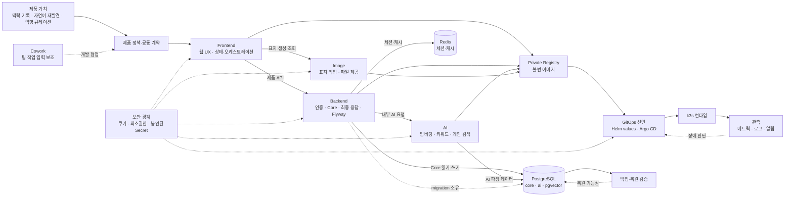

# 프로젝트 지식 그래프

아래 그래프는 제품 가치가 각 실행 영역과 운영 통제로 어떻게 이어지는지 보여준다. 실선은 주 흐름, 점선은 품질·보안·운영 통제 또는 보조 도구 관계다.

## 관계 해설

### 제품 가치 → Frontend

사용자는 장소를 단순 북마크하지 않고 Context와 함께 Record로 만들며, 개인 자연어 검색과 익명 Collection 탐색으로 다시 사용한다. Frontend는 장소 검색, Context 작성, Record·Collection·Feed·Library 화면과 비동기 결과의 중간 상태를 표현한다. 근거: [서비스 기획서](../static/01_서비스_기획서.md), [유저플로우](../static/09_유저플로우.md), [Frontend 아키텍처](https://github.com/Team-PinLog/front/blob/dev/docs/architecture.md).

### Frontend → Backend

Frontend는 쿠키 기반 인증을 사용하고 서버 상태를 Query 계층에서 관리한다. 인가, Core 상태, 최종 응답 봉투는 Backend가 판단한다. Context 수정 후 식별자가 바뀌는 계약과 AI 결과가 비어 있을 수 있는 정상 상태도 이 경계에서 지켜야 한다. 근거: [Frontend API 계약](https://github.com/Team-PinLog/front/blob/dev/docs/api-contract.md), [인증 설계](../static/11_인증_설계.md).

### Backend → AI

Backend는 Context와 AI State를 같은 Core 작업 흐름에서 준비하고 커밋 뒤 AI 처리를 요청한다. AI는 임베딩, 프리셋 후보, 모델 판정, 개인 벡터 검색을 수행하지만 `core`를 조회하거나 사용자 권한을 판단하지 않는다. 근거: [AI 공용 설계](../static/05_AI_설계.md), [AI 내부 아키텍처](https://github.com/Team-PinLog/ai/blob/dev/docs/spec/architecture.md).

### Frontend → Image

Collection은 표지 없이 먼저 생성될 수 있다. Frontend가 Image 서비스의 후보 작업을 조회하고 사용자의 스타일 선택 뒤 최종본을 기다린 다음, Backend의 Collection 표지 필드에 결과 경로를 등록한다. 작업자 전용 경로와 인증정보는 브라우저에 노출하지 않는다. 근거: [Frontend API 계약의 표지 생성 절](https://github.com/Team-PinLog/front/blob/dev/docs/api-contract.md), [Image README](https://github.com/Team-PinLog/image/blob/feat/gpu-cover-worker-mvp/README.md).

### Backend·AI → PostgreSQL·Redis

Backend는 `core`와 `ai`를 포함한 Flyway migration을 실행한다. AI 런타임은 `ai` 스키마에만 접근하고 pgvector를 사용한다. Redis는 Backend의 세션·캐시 경계이며 DB와 동일한 준비성 의미를 갖는다고 자동 가정하지 않는다. 근거: [DB migration 안내](https://github.com/Team-PinLog/back/blob/dev/src/main/resources/db/migration/README.md), [AI 아키텍처](https://github.com/Team-PinLog/ai/blob/dev/docs/spec/architecture.md), [Backend readiness 결정](https://github.com/Team-PinLog/back/blob/dev/docs/backend/decisions/BD-28-readiness-includes-db.md).

### 서비스 소스 → Registry → GitOps → 런타임

서비스 CI가 검증한 커밋 기반 태그와 digest의 불변 이미지를 private registry에 게시하고, Infra의 서비스별 values 변경이 검증·병합된 뒤 Argo CD가 원하는 상태를 반영하는 구조다. 서비스 저장소가 배포 브랜치를 직접 바꾸거나 런타임을 직접 수정하는 경로가 아니다. 근거: [Infra Git/CI 거버넌스](https://github.com/Team-PinLog/infra/blob/main/docs/git-governance.md), [공용 Helm 값](https://github.com/Team-PinLog/infra/blob/main/charts/microservice/values.yaml), [ApplicationSet](https://github.com/Team-PinLog/infra/blob/main/argocd/applicationsets/services-prod.yaml).

### 런타임 → 관측·백업·보안

애플리케이션 probe와 metric endpoint, ServiceMonitor, 로그 수집, 내부·외부 실패 도메인이 다른 알림 경로를 연결한다. PostgreSQL 백업은 생성 성공뿐 아니라 archive 열기와 격리 복원 검증이 필요하며, 단일 노드 밖 사본이 별도 위험을 줄인다. Secret은 값이 아니라 참조와 소유권만 문서화한다. 근거: [모니터링](https://github.com/Team-PinLog/infra/blob/main/docs/monitoring.md), [운영 알림](https://github.com/Team-PinLog/infra/blob/main/docs/alerting.md), [운영 런북](https://github.com/Team-PinLog/infra/blob/main/docs/runbook.md), [Secret 관리](https://github.com/Team-PinLog/infra/blob/main/secrets/README.md).

## 책임 경계 요약

| 제공자 | 소비자 | 제공 계약 | 제공자가 하지 않는 일 |
|---|---|---|---|
| Product docs | 모든 파트 | 용어·정책·파트 간 계약 | 구현 상태 추정 |
| Frontend | 사용자 | 화면 상태, 입력 검증, 비동기 진행 표현 | 서버 인가 판단 |
| Backend | Frontend | 외부 API, 인증·인가, 최종 DTO | 모델·벡터 계산 |
| AI | Backend | 내부 처리·검색 결과 | Core 조회·migration |
| Image | Frontend·GPU worker | 표지 작업·파일 경로 | Collection 소유권 판단 |
| Infra | 서비스 | 실행·네트워크·Secret 참조·probe·자원 계약 | 앱 로직·migration 내용 |
| Observability | 운영자 | 증거와 알림 | 자동 원인 확정·무승인 복구 |
