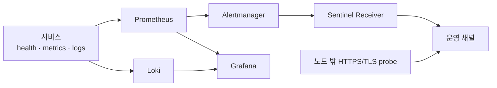

# 운영 원칙과 검증 경계

이 문서는 운영 서버의 현재 상태 보고서가 아니다. 저장소가 선언한 설계·정책과 과거 작업 문서의 당시 기록을 분리해 정리한다. 이번 문서화 과정에서는 k3s, Argo CD, live DB, 외부 서비스에 접속하거나 변경하지 않았다.

## 1. 상태 표기 규칙

| 표기 | 의미 | 사용 방법 |
|---|---|---|
| 설계 | 팀이 지키기로 한 구조·원칙 | 아키텍처·결정 문서를 근거로 설명 |
| 선언 | 각 GitHub 저장소의 YAML·설정에 적힌 원하는 상태 | 실제 runtime 상태로 단정하지 않음 |
| 당시 기록 | 날짜가 있는 검증·장애·TDD 로그 | 현재에도 동일하다고 일반화하지 않음 |
| 미확인 | live 조회 없이는 알 수 없는 항목 | 확인 명령과 성공 기준만 제시 |

## 2. 배포 원칙

### 설계

1. 서비스 소스 변경은 테스트·빌드 후 commit 기반 태그와 digest가 고정된 private image artifact로 만든다.
2. source CI와 registry digest를 다시 확인한 뒤 Infra의 서비스 values만 기능 브랜치 변경 요청으로 갱신한다.
3. 정책 검사, 저장소 guardrail, Helm lint·render가 통과한 exact head만 기준 브랜치에 병합한다.
4. Argo CD가 Git의 원하는 상태를 반영한다. 정상 rollback도 기준 선언의 역변경과 검증으로 수행한다.
5. 클러스터 pull credential, 서비스별 image updater credential, repository automation credential을 서로 분리한다.

근거: [Git/CI 거버넌스](https://github.com/Team-PinLog/infra/blob/main/docs/git-governance.md), [Infra README의 CI/CD 흐름](https://github.com/Team-PinLog/infra/blob/main/README.md).

### 선언

- 공용 chart는 기본 `RollingUpdate`, `maxUnavailable: 0`, 명시적 resource, non-root, privilege escalation 금지, capability 제거를 제공한다.
- Backend prod values는 세 probe를 구분하고 Actuator metric 수집을 켠다.
- AI dev values는 startup/liveness와 readiness 경로를 분리하고 preset bootstrap을 Deployment 전에 실행하도록 선언한다.
- Image prod values는 singleton SQLite·PVC 특성에 맞춰 `Recreate`와 영속 볼륨을 선언한다.

근거: [공용 Helm 값](https://github.com/Team-PinLog/infra/blob/main/charts/microservice/values.yaml), [Backend values](https://github.com/Team-PinLog/infra/blob/main/apps/prod/back/values.yaml), [AI values](https://github.com/Team-PinLog/infra/blob/main/apps/dev/ai/values.yaml), [Image values](https://github.com/Team-PinLog/infra/blob/main/apps/prod/image/values.yaml).

### 미확인

현재 Argo sync 상태, 실행 imageID, replica readiness, rollout 이력은 이 GitHub 프로젝트 지식 문서만으로 알 수 없다. 필요하면 승인된 운영 세션에서 읽기 전용으로 Git revision ↔ Argo revision ↔ Pod imageID를 대조해야 한다.

## 3. Probe와 rollout 계약

| 서비스 | startup | liveness | readiness | 운영 의미 |
|---|---|---|---|---|
| Backend | 기동 중 liveness 경로가 응답할 시간을 제공 | 프로세스 생존, 외부 의존성 재시작 전파 방지 | DB 연결 포함, Redis 제외 | DB를 쓸 수 없는 Pod를 트래픽에서 제외 |
| AI | 정적 health | 정적 health | DB 확인 + preset cache | 외부 모델 호출 없이 요청 수용 조건 확인 |
| Image | health | health | health | API 프로세스 응답 여부; 작업자·GPU 준비와 동일하지 않음 |

- probe 경로는 애플리케이션의 base/context path와 정확히 일치해야 한다.
- startup이 통과하기 전 liveness/readiness가 성급하게 동작하지 않게 한다.
- liveness에 DB·외부 모델을 넣어 순단을 restart 폭주로 확대하지 않는다.
- readiness 실패는 재시작 명령이 아니라 우선 트래픽 격리 신호로 읽는다.
- `RollingUpdate`는 Pod 교체 가용성 계약이고, 단일 DB·단일 노드 장애를 해결하지 않는다.
- `Recreate` 서비스는 교체 중 중단을 감수하므로 상태 파일·PVC 쓰기 일관성을 먼저 지킨다.

근거: [Backend readiness 결정](https://github.com/Team-PinLog/back/blob/dev/docs/backend/decisions/BD-28-readiness-includes-db.md), [AI 배포 gate](https://github.com/Team-PinLog/ai/blob/dev/docs/implements/2026-07-29-dev-deployment-gates.md), [Deployment template](https://github.com/Team-PinLog/infra/blob/main/charts/microservice/templates/deployment.yaml).

## 4. 데이터베이스·migration·cache 운영 계약

### PostgreSQL과 pgvector

- PostgreSQL은 `core`와 `ai` 스키마를 함께 제공하고 pgvector 타입 요구를 만족해야 한다.
- Flyway migration 실행 주체는 Backend다. AI는 startup DDL을 실행하지 않고 테이블이 준비되지 않으면 실패한다.
- AI DB role은 `ai` 스키마 중심 최소권한과 `ai, public` search path를 사용한다. `public`은 vector 타입 해석에 필요하다.
- DB image·extension 변경은 major version, PVC, data path, Secret 참조를 보존하고 fresh backup과 archive 검증 뒤 승인된 GitOps 변경으로 수행한다.
- vector extension이 DB catalog에 반영된 뒤에는 stock DB image로 단순 rollback하지 않는다.

근거: [AI 아키텍처](https://github.com/Team-PinLog/ai/blob/dev/docs/spec/architecture.md), [pgvector 전환 runbook](https://github.com/Team-PinLog/infra/blob/main/docs/postgres-pgvector-migration.md), [Migration README](https://github.com/Team-PinLog/back/blob/dev/src/main/resources/db/migration/README.md).

### Flyway

- migration 파일이 schema history의 정본이며 애플리케이션별 임의 DDL을 금지한다.
- migration은 순서·기존 데이터·extension 호환성을 Testcontainers 기반 통합 테스트로 검증한다.
- 이 문서는 migration 내용을 추가하거나 변경하지 않는다.

근거: [Migration README](https://github.com/Team-PinLog/back/blob/dev/src/main/resources/db/migration/README.md), [Backend DB 규약](https://github.com/Team-PinLog/back/blob/dev/docs/development/database-conventions.md), [Backend README](https://github.com/Team-PinLog/back/blob/dev/README.md).

### Redis

Redis는 세션·cache 소비 경계다. 현재 readiness에 자동 포함되지 않으며, 데이터 유실 허용 여부는 저장 내용에 따라 다르다. 단순 cache와 회전 refresh 상태를 같은 복구 정책으로 취급하면 안 된다. Redis가 서비스 핵심 상태를 더 많이 소유하게 되면 PVC/AOF, timeout, readiness를 함께 재검토해야 한다. 근거: [Infra 아키텍처](https://github.com/Team-PinLog/infra/blob/main/docs/architecture.md), [Backend readiness 결정](https://github.com/Team-PinLog/back/blob/dev/docs/backend/decisions/BD-28-readiness-includes-db.md).

## 5. 관측 원칙

### 설계

- Backend의 Actuator metric은 ServiceMonitor를 통해 수집하고, 로그는 Alloy→Loki 경로로 모은다.
- 내부 상태 알림과 노드 밖 가용성 probe를 분리한다. 노드 전체가 사라지면 내부 알림 경로도 함께 사라지기 때문이다.
- 알림 진단은 확인 사실과 추정을 구분하고, 근거 부족 시 원인을 확정하지 않는다.
- 원시 alert·로그를 무제한으로 모델에 전달하지 않고 allowlist, bounded query, redaction, deterministic fallback을 사용한다.
- 복구 알림과 경고·심각도 mention 정책을 코드 경계에서 강제한다.

근거: [모니터링](https://github.com/Team-PinLog/infra/blob/main/docs/monitoring.md), [운영 알림](https://github.com/Team-PinLog/infra/blob/main/docs/alerting.md), [Sentinel Receiver](https://github.com/Team-PinLog/infra/blob/main/ops/sentinel-receiver/README.md).

### 당시 기록과 불확실성

모니터링 문서에는 특정 날짜의 용량 측정, 단계적 활성화 계획과 구현 상태가 섞여 있다. 이 값들은 현재 용량 보장이나 활성 상태가 아니다. 특히 dashboard·수집기·외부 monitor가 현재 실행 중인지 여부는 live readback 없이 확정하지 않는다.

## 6. 로그·민감정보 원칙

- API key, token, password, cookie 원문, webhook URL, kubeconfig, 전체 환경변수를 출력하지 않는다.
- Context 원문, 실제 사용자 식별자, 실제 장소 기록을 운영 문서·공유 dump·알림 payload에 넣지 않는다.
- 오류 응답의 credential·endpoint body는 redaction하고, 사용자가 전달할 수 있는 trace identifier와 안전한 오류 분류만 남긴다.
- Secret은 변수명·owner·주입 위치·rotation/rollback 계약만 문서화하고 값은 안전한 저장소에 둔다.
- 브라우저에 포함되는 공개 설정은 비밀로 간주하지 말고 공급자 콘솔의 허용 도메인·권한 제한을 적용한다.

근거: [배포 변수·Secret 표준](../static/12_배포_변수_및_Secret_표준.md), [AI 로그 redaction 기록](https://github.com/Team-PinLog/ai/blob/dev/docs/troubleshooting/2026-07-31-log-redaction-pitfalls.md), [Secret 관리](https://github.com/Team-PinLog/infra/blob/main/secrets/README.md).

## 7. 백업·복원 원칙

### 설계

1. PostgreSQL backup job의 성공 로그만으로 완료 처리하지 않는다.
2. 생성 artifact가 fresh하고 비어 있지 않으며 `pg_restore --list`로 열리는지 확인한다.
3. 사용자 객체가 있어야 하는 DB에서 archive 목록이 비어 있으면 실패로 본다.
4. 정기적으로 격리된 scratch DB에 복원하고 schema history·필수 schema·extension·대표 무결성을 점검한다.
5. 단일 노드·단일 디스크 밖으로 암호화된 사본을 반출하고 접근권한·보존·폐기를 관리한다.
6. 운영 데이터 dump는 GitHub 저장소에 포함하지 않는다. 공유가 필요하면 schema-only 또는 검토된 비식별 demo data만 별도 승인 절차로 다룬다.
7. Sealed Secret 복구 키는 DB dump와 별개 실패 도메인에 안전하게 보관해야 한다.

근거: [운영 런북](https://github.com/Team-PinLog/infra/blob/main/docs/runbook.md), [pgvector 전환 runbook](https://github.com/Team-PinLog/infra/blob/main/docs/postgres-pgvector-migration.md), [Secret 관리](https://github.com/Team-PinLog/infra/blob/main/secrets/README.md).

### 미확인

최근 backup 성공 시각, 외부 사본 존재, restore drill 결과, 실제 보존 기간은 이 저장소 문서만으로 현재성을 보장할 수 없다. 운영 인수 시 반드시 별도 증거를 확인해야 한다.

## 8. 장애 대응 순서

1. 사용자 영향과 범위를 먼저 확인한다: 외부 경로, 특정 서비스, DB·cache, 노드 전체 중 어디인가.
2. GitOps revision, Pod 상태·event, 이전 container 로그, probe 결과를 시간 순으로 모은다.
3. 원인 가설과 확인 사실을 분리한다. `Running`은 `Ready`와 같지 않고, 내부 health는 외부 경로 가용성과 같지 않다.
4. image pull, Secret 참조, path·port, DB, resource pressure, DNS·NetworkPolicy를 경계별로 좁힌다.
5. 긴급 live 변경보다 원하는 Git 상태를 고치는 rollback을 우선한다. 변경 전 데이터·PVC·Secret 영향과 승인 경계를 확인한다.
6. rollback 뒤 Git revision, Argo sync, imageID, readiness, 외부 smoke, error metric·log를 함께 검증한다.
7. 재발 방지는 코드·manifest·test·runbook 중 올바른 정본에 반영한다.

근거: [운영 런북](https://github.com/Team-PinLog/infra/blob/main/docs/runbook.md), [NetworkPolicy](https://github.com/Team-PinLog/infra/blob/main/docs/network-policies.md), [Backend troubleshooting](https://github.com/Team-PinLog/back/blob/dev/docs/backend/troubleshooting/README.md), [AI troubleshooting](https://github.com/Team-PinLog/ai/blob/dev/docs/troubleshooting/README.md).

## 9. 서비스별 최소 운영 체크

| 영역 | 배포 전 | 배포 후 | rollback 판단 |
|---|---|---|---|
| Frontend | build, API base/path, runtime config, Image 전용 client 경계 | 정적 자산·제품 API·인증 callback·오류 fallback | 새 자산 실패, 계약 불일치, 인증 루프 |
| Backend | test, Flyway, jar artifact, image digest, Secret key 존재 | startup/liveness/readiness, metric target, DB·Redis 오류 | readiness 지속 실패, migration 호환성, 5xx 증가 |
| AI | test, migration 선행, preset bootstrap, 내부 Secret, model smoke | health, ready, 내부 처리·검색, 상태 전이·redaction | bootstrap 실패, profile 불일치, DB 권한 오류 |
| Image | test, PVC writable, worker Secret 참조, Recreate 영향 | health, claim/result, 파일 읽기, stale job 회복 | PVC 쓰기 실패, 작업 상태 손상, 파일 경로 불일치 |
| Infra | policy, schema, Helm render, 변경 파일 제한 | Argo revision, rollout, probe, metric/log | 원하는 상태와 실제 상태 불일치, 자원·네트워크 회귀 |

이 표는 실행 결과가 아니라 검증 항목이다. 실제 배포 완료 증거는 승인된 환경에서 별도로 수집해야 한다.
