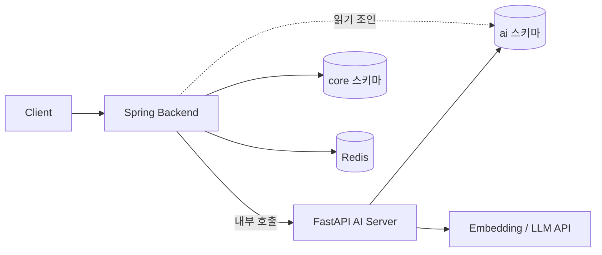
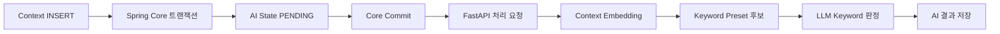
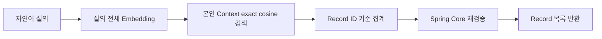

# PinLog AI 설계

> 이 문서는 PinLog AI 시스템의 공용 아키텍처와 파트 간 계약을 정의하는 단일 원본입니다.
>
> FastAPI 내부 구현은 `Team-PinLog/ai/docs/`에서 관리합니다.
> Spring 연동과 Feed 구현은 `Team-PinLog/back/docs/`에서 관리합니다.

## 1. 목적

PinLog의 AI는 사용자가 장소 이름을 기억하지 못해도 저장 당시의 맥락으로 자신의 기록을 다시 찾게 하는 것을 목적으로 합니다.

이를 위해 두 가지 파생 데이터를 생성합니다.

| 파생 데이터 | 용도 |
|---|---|
| Context Embedding | 본인 자연어 검색 |
| Context Keyword | 화면 표시, 타인 공개 표현, Feed 추천 특징 |

기능 명칭은 구현 기술과 무관하게 `AI 자연어 검색`으로 통일합니다.

AI는 Place·Record·Collection 기본 기능의 부가 계층입니다. AI가 동작하지 않아도 저장·조회·발행은 정상 동작해야 합니다.

## 2. 핵심 원칙

다음은 모든 파트가 공유하는 불변 원칙입니다.

1. 사용자가 작성한 Context 원문은 개인 데이터입니다.
2. 자연어 검색은 로그인한 User 본인의 Context만 대상으로 합니다.
3. AI 처리 단위는 Record가 아니라 Context입니다.
4. **Context는 생성 후 본문을 변경하지 않는 불변 엔티티입니다.**
5. **`context_id`는 특정 Context 본문의 불변 식별자입니다.**
6. **Context 수정은 구 Context 삭제와 신 Context 생성의 조합입니다.**
7. 구 Context와 신 Context는 서로 독립된 AI 처리 단위입니다.
8. 각 Context는 독립 Embedding과 Keyword 결과를 가집니다.
9. AI 분석 완료는 Record 저장이나 Collection 발행의 조건이 아닙니다.
10. AI 실패가 Place, Record, Collection 기본 기능을 중단시키지 않습니다.
11. Keyword가 미완료이거나 실패하면 Keyword만 생략합니다.
12. Spring은 Core 도메인과 최종 응답을 담당합니다.
13. FastAPI는 AI 계산과 AI 파생 데이터 처리를 담당합니다.
14. FastAPI는 `core.*`를 직접 조회하거나 수정하지 않습니다.
15. Feed는 Spring이 담당하며 요청 시 LLM과 Embedding API를 호출하지 않습니다.
16. GraphRAG와 RAG는 MVP에 포함하지 않습니다.

## 3. 시스템 구성과 책임



Client는 FastAPI를 직접 호출하지 않습니다. 모든 외부 요청은 Spring을 거칩니다.

### 3.1 Spring Backend

- Core 도메인과 트랜잭션
- User 인증과 권한 확인
- Record, Context, Collection, Place 관리
- Context 생성과 삭제, 그리고 그 조합인 수정 처리
- AI State 생성과 `PENDING` 초기화
- Context 삭제 시 AI 작업 `CANCELLED`
- 재시도 횟수 관리와 재스캔
- 재시도 소진 작업의 `FAILED` 종결(Finalizer)
- 최신 Core Context를 FastAPI에 전달
- 자연어 검색 요청의 User 범위 확정
- FastAPI 검색 결과의 Core 상태와 소유권 재검증
- Keyword 공개 범위에 맞는 최종 응답 조립
- Feed 후보 생성, Cache, 점수 계산, 이벤트 관리
- `ai` 스키마를 포함한 DB Migration 실행

Spring은 AI 모델 호출과 벡터 계산을 직접 구현하지 않습니다. Embedding API와 LLM API 호출은 전부 FastAPI가 담당합니다.

### 3.2 FastAPI AI Server

- Context Embedding 생성
- 검색어 Embedding 생성
- Keyword Preset 후보 벡터 검색
- LLM을 통한 후보 Keyword 최종 판정
- AI 파생 데이터 저장
- 개인 Context 벡터 검색
- AI State 기반 부분 재개
- 현재 상태를 검사한 결과 저장
- Keyword Preset Cache

### 3.3 접근 금지 경계

FastAPI는 다음을 하지 않습니다.

- `core.*` 스키마 접근
- Core 도메인 상태 변경
- User 인증 정책 판단
- Collection 발행 여부 판단
- Feed API 제공
- Feed 점수 계산
- `PENDING` 또는 `CANCELLED` 상태 생성
- 재시도 소진 여부 판단
- `context_embedding.is_deleted` 변경

Spring은 다음을 하지 않습니다.

- Embedding API 직접 호출
- LLM API 직접 호출
- 벡터 유사도 계산
- FastAPI 작업 중 오류를 대신 판단한 `FAILED` 기록

## 4. AI 처리 단위

### 4.1 Record와 Context

```text
User
→ Record
   → Context 1
   → Context 2
   → Context 3
```

- Record는 User와 Place의 연결 단위입니다.
- Context는 그 Place를 저장한 이유를 나타내는 독립 서술 단위입니다.
- 같은 Place를 저장한 여러 이유는 새 Record가 아니라 여러 Context로 표현합니다.

### 4.2 Context 불변성

Context는 불변 엔티티입니다. 본문을 in-place로 UPDATE하지 않습니다.

핵심 불변식:

```text
동일한 context_id는 항상 동일한 Context 본문을 의미한다.
```

본문이 한 글자라도 바뀌면 새로운 Context가 됩니다.

```text
구 Context 소프트 삭제
→ 구 Context AI 작업 CANCELLED
→ 새 Context INSERT
→ 새 context_id 발급
→ 새 AI State 생성
→ 새 AI 처리 시작
```

이 결정이 AI 설계 전반을 단순하게 만듭니다. 동일 식별자 안에서 서로 다른 본문이 공존하지 않으므로, 본문 세대를 구분하기 위한 별도의 버전 컬럼이 필요하지 않습니다.

수정 경합은 별도의 방어 장치를 갖지 않고 삭제 경합으로 흡수됩니다. 이는 방어를 약화한 것이 아니라 **방어해야 할 동일 ID의 가변 상태 자체를 제거한 것**입니다.

구 Context의 AI State와 AI 파생 데이터는 신 Context로 승계하지 않습니다.

승계 금지 대상:

- Embedding
- Keyword
- Keyword Analysis
- AI State
- `retry_count`
- `COMPLETED` 상태
- `FAILED` 상태

구 Context의 완료된 Embedding도 신 Context에서 재사용하지 않습니다. 새 Context는 항상 새 Embedding과 새 Keyword 판정을 수행합니다.

### 4.3 Context 단위 Embedding

Embedding과 Keyword는 Context별로 생성합니다.

Record 단위로 생성하면 Context 하나를 수정하거나 삭제할 때 어느 파생 데이터를 제거할지 판별할 수 없어 Record 전체를 재분석해야 합니다. Context 단위 저장은 수정·삭제의 영향 범위를 해당 Context로 한정합니다.

### 4.4 Keyword의 파생 구조

```text
Context Keyword   ← 원본
→ Record Keyword 집계
→ Collection Keyword 집계
```

- 원본은 Context Keyword입니다.
- Record Keyword와 Collection Keyword는 저장하지 않고 읽기 시점 집계 또는 Cache로 구성합니다.
- Record 단위 Keyword 테이블을 원본 AI 판정 테이블로 사용하지 않습니다.

## 5. 비동기 AI 처리

### 5.1 전체 처리 흐름



AI 처리는 Core 저장 트랜잭션 바깥에 있습니다.

- FastAPI 호출에 실패해도 Core 저장은 성공 상태를 유지합니다.
- AI 실패로 Context 저장을 롤백하지 않습니다.
- 유실된 요청은 Spring Scheduler가 영속 AI State를 기준으로 복구합니다.

AI State가 DB에 영속되므로 별도 메시지 큐나 Outbox 없이 재처리가 가능합니다. Kafka, RabbitMQ, 별도 Outbox를 MVP에 도입하지 않습니다.

### 5.2 Context 생성

```text
새 Context INSERT
→ 새 context_id 발급
→ AI State INSERT
→ embedding_status = PENDING
→ keyword_status = PENDING
→ retry_count = 0
→ Core Commit
→ FastAPI 처리 요청
```

Record는 커밋 즉시 활성 상태가 됩니다. AI 처리 완료를 기다리지 않습니다.

생성 완료 전에는 Keyword가 비어 있을 수 있으며, 화면과 API 응답은 이 상태를 정상으로 취급해야 합니다.

### 5.3 Context 수정

**별도의 Context UPDATE 경로를 만들지 않습니다.** 수정은 기존 두 동작의 조합입니다.

```text
1. 구 Context 삭제 처리
2. 신 Context 생성 처리
```

구체적 흐름:

```text
Context 수정 요청
→ 기존 Context와 소유권 확인
→ 새 Context INSERT
→ 새 context_id 발급
→ 새 AI State PENDING 생성
→ 구 Context 소프트 삭제
→ 구 embedding_status = CANCELLED
→ 구 keyword_status = CANCELLED
→ 존재하는 구 Embedding is_deleted = true
→ Core Commit
→ 새 context_id로 FastAPI 호출
```

**신 Context를 먼저 INSERT한 뒤 구 Context를 삭제합니다.** 순서가 중요합니다.

활성 Record는 활성 Context를 최소 한 개 가져야 하며, 이를 위해 마지막 Context의 개별 삭제를 금지합니다. 구 Context를 먼저 삭제하면 Context가 하나뿐인 Record에서 이 가드에 걸려 수정이 불가능해집니다. 신 Context를 먼저 넣으면 트랜잭션 내내 활성 Context가 최소 한 개 유지되므로, **수정 경로를 위해 가드를 예외 처리할 필요가 없습니다.**

구 Context와 신 Context 사이에 AI 상태를 승계하지 않습니다. 신 Context는 항상 새 AI 처리 단위입니다.

외부 API는 수정 Endpoint 형태를 유지할 수 있으나, **응답에는 새 `contextId`를 반환해야 합니다.** 구 `contextId`를 계속 사용하는 응답 계약은 허용하지 않습니다.

### 5.4 Context 삭제

```text
Context 소프트 삭제
→ 존재하는 context_embedding.is_deleted = true
→ embedding_status = CANCELLED
→ keyword_status = CANCELLED
→ updated_at 갱신
```

Embedding Row가 아직 없어 `is_deleted` UPDATE의 영향 행 수가 0이어도 정상입니다. 이 경우 늦게 도착하는 Embedding INSERT는 State의 `CANCELLED`가 차단합니다.

삭제 이후 도착한 AI 결과는 저장하지 않습니다.

### 5.5 수정 트랜잭션 원칙

구 Context 삭제와 신 Context 생성은 **하나의 Spring Core 트랜잭션**에서 처리합니다.

```text
구 Context 조회 및 잠금
→ 신 Context INSERT
→ 신 AI State PENDING
→ 구 Context 소프트 삭제
→ 구 AI State CANCELLED
→ 구 Embedding is_deleted = true
→ Commit
→ Commit 이후 신 context_id로 FastAPI 호출
```

INSERT를 삭제보다 앞에 두어 활성 Context 수가 한 번도 0이 되지 않게 합니다. 트랜잭션 중간에 두 Context가 함께 활성인 구간이 생기지만, 커밋 전이므로 외부에서 관측되지 않습니다.

FastAPI 호출은 트랜잭션에 포함하지 않습니다.

| 상황 | 결과 |
|---|---|
| 트랜잭션 실패 | 구 Context 삭제와 신 Context 생성 모두 롤백 |
| 트랜잭션 성공, FastAPI 호출 실패 | 신 Context와 `PENDING` State 유지, Scheduler가 복구 |

## 6. AI State

### 6.1 상태 컬럼

`ai.context_ai_state`는 하나의 통합 status가 아니라 두 상태를 가집니다.

| 컬럼 | 대상 단계 |
|---|---|
| `embedding_status` | Embedding 생성·저장 |
| `keyword_status` | Preset 후보 검색과 LLM 판정·저장 |

두 컬럼은 같은 상태 집합을 독립적으로 사용합니다. 한쪽이 `COMPLETED`이고 다른 쪽이 `PENDING`인 상태가 정상적으로 존재할 수 있으며, 이것이 부분 재개의 기반입니다.

### 6.2 상태값

- `PENDING`
- `PROCESSING`
- `COMPLETED`
- `FAILED`
- `CANCELLED`

### 6.3 상태 전이

```text
PENDING
→ PROCESSING
   → COMPLETED
   → FAILED

PENDING / PROCESSING / COMPLETED / FAILED
→ CANCELLED
```

규칙:

- `FAILED`에서 `PROCESSING`으로 직접 전이하지 않습니다.
- `FAILED`는 진짜 종결 상태입니다. 같은 Context를 다시 처리하는 경로는 존재하지 않습니다.
- 사용자가 본문을 수정하면 구 Context는 `CANCELLED`가 되고, 새 Context가 새 `PENDING` State로 시작합니다.
- `CANCELLED`는 처리·저장·검색·조회·재스캔 어느 대상도 아닙니다.
- 상태 변경 시 `updated_at`을 갱신합니다.

Context 수정이 기존 State를 재사용하지 않으므로, **기존 State를 `PENDING`으로 되돌리는 전이는 존재하지 않습니다.**

### 6.4 상태 쓰기 책임

| 상태 변경 | Spring | FastAPI |
|---|:---:|:---:|
| AI State 최초 생성 | O | X |
| `PENDING` 생성 | O | X |
| `PROCESSING` | X | O |
| `COMPLETED` | X | O |
| 작업 중 명시적 오류 `FAILED` | X | O |
| 재시도 소진 Finalizer `FAILED` | O | X |
| `CANCELLED` | O | X |
| `retry_count` | O | X |
| `is_deleted` | O | X |

- Spring은 FastAPI 작업 중 오류를 대신 판단해 `FAILED`로 쓰지 않습니다.
- FastAPI는 재시도 횟수 소진 여부를 판단하지 않습니다.
- 양쪽이 같은 실패 사유로 `FAILED`를 기록하지 않습니다.

### 6.5 PROCESSING 전환

FastAPI는 작업 시작 전 조건부 UPDATE로 `PROCESSING`을 선점합니다.

Embedding 단계:

```sql
UPDATE ai.context_ai_state
SET embedding_status = 'PROCESSING',
    updated_at = now()
WHERE context_id = :context_id
  AND embedding_status IN ('PENDING', 'PROCESSING');
```

Keyword 단계는 다음 조건을 추가합니다.

```text
embedding_status = COMPLETED
AND keyword_status IN (PENDING, PROCESSING)
```

영향 행 수가 0이면 **모델을 호출하지 않고 결과도 저장하지 않으며 즉시 종료**합니다.

`CANCELLED`, `COMPLETED`, `FAILED` 상태에서는 새 작업을 시작하지 않습니다.

`PROCESSING`을 허용 조건에 넣는 것은 중단된 stale 작업의 재개를 위한 것입니다. 다만 조건 없이 허용하면 동시에 도착한 중복 요청 둘 다 전이에 성공하여 같은 작업이 두 번 실행됩니다. 따라서 **`PROCESSING` 재선점은 만료된 경우로 한정**합니다.

```sql
AND (
      embedding_status = 'PENDING'
   OR (embedding_status = 'PROCESSING'
       AND updated_at < now() - :processing_timeout)
)
```

만료 기준은 Spring 재스캔의 `PROCESSING` 만료(10분)와 같은 설정값을 사용합니다. 이 조건이 있어야 §13.1의 멱등성이 성립합니다.

### 6.6 결과 저장 불변식

AI 결과는 대상 단계가 `PROCESSING`일 때만 저장합니다.

```text
대상 단계 status == PROCESSING
```

Context가 불변이고 `context_id`가 본문 정체성을 나타내므로 별도의 Version 검사는 필요하지 않습니다.

저장 직전 State Row를 잠그고 상태를 검사합니다.

```sql
SELECT embedding_status, keyword_status
FROM ai.context_ai_state
WHERE context_id = :context_id
FOR UPDATE;
```

| 저장 대상 | 조건 |
|---|---|
| Embedding | `embedding_status = PROCESSING` |
| Keyword | `embedding_status = COMPLETED` AND `keyword_status = PROCESSING` |

조건을 만족하지 않으면 결과를 폐기합니다.

모델 호출 전 사전 검사는 불필요한 API 비용을 줄이기 위한 것이고, 저장 직전 잠금 검사는 정합성을 보장하기 위한 것입니다. 두 검사는 서로를 대체하지 않습니다.

## 7. Embedding

### 7.1 모델과 Profile

| 항목 | MVP 값 |
|---|---|
| Model | `text-embedding-3-small` |
| Dimension | 1536 |
| Distance | cosine |
| 저장 | PostgreSQL + pgvector |

Embedding Profile은 모델·차원·거리 기준을 하나의 문자열로 식별합니다.

```text
openai-text-embedding-3-small-1536-cosine-v1
```

- Context와 Keyword Preset은 같은 Embedding Profile을 사용합니다.
- Spring과 FastAPI에 Profile을 각각 하드코딩하지 않습니다.
- 배포 환경의 단일 설정에서 주입합니다.

Profile 문자열의 버전 표기는 모델·전처리 구성을 식별하는 값이며 Context와 무관합니다.

### 7.2 Embedding 저장

Embedding은 `ai.context_embedding`에 Context 단위로 저장하며, 생성 시점의 `embedding_profile`을 함께 기록합니다. `context_id`가 Primary Key입니다.

### 7.3 Profile 일치

검색과 Keyword 판정 모두 현재 Profile과 일치하는 Embedding만 사용합니다.

Profile이 다른 Embedding은 차원이나 거리 기준이 달라 비교가 성립하지 않으므로 계산에 포함하지 않습니다. Profile 변경은 재생성 대상 판별의 기준이 됩니다.

### 7.4 부분 재사용

같은 Context의 Keyword 단계를 재시도할 때, 저장된 Embedding이 존재하고 `embedding_profile`이 현재 값과 일치하면 Embedding API를 다시 호출하지 않고 재사용합니다.

```text
저장된 Embedding 확인
→ Profile 확인
→ Embedding API 호출 생략
→ Keyword 단계부터 재개
```

수정된 Context는 새 `context_id`이므로 구 Context의 Embedding을 재사용하지 않습니다.

## 8. Keyword Preset

### 8.1 Keyword 생성 방식

Keyword는 LLM이 자유 생성하지 않습니다.

```text
Context Embedding
→ Preset Embedding 유사도 후보 검색
→ 후보만 LLM에 전달
→ 후보 keyword_id 중 선택
```

- LLM은 후보 목록에 없는 Keyword를 반환할 수 없습니다.
- 목록 밖 값이 반환되면 매핑 단계에서 폐기합니다.
- 매칭되는 Keyword가 하나도 없을 수 있으며, 이는 오류가 아니라 정상 완료입니다.

### 8.2 Preset 범주

초기 범주는 네 가지입니다.

- `COMPANION`
- `ACTIVITY`
- `ATMOSPHERE`
- `SITUATION`

초기 전체 Preset 수는 약 25~30개로 운영합니다.

지역과 Place 카테고리는 Keyword가 아니라 Place metadata로 관리합니다.

Preset이 가지는 정보:

- `code`
- `displayName`
- `category`
- `description`
- `examples`
- `embedding`
- `embeddingProfile`
- `visibility`
- `active`
- `version`

`description`과 `examples`는 LLM 판정 품질을 좌우하므로 필수입니다. Preset의 `version`은 프리셋 목록의 개정 번호이며 Context와 무관합니다.

### 8.3 Visibility

| Visibility | 본인 제공 | 타인 공개 | 본인 개인화 Profile | 타인 Collection Feed 특징 |
|---|---|---|---|---|
| `PUBLIC` | O | O | O | O |
| `PRIVATE_ONLY` | O | X | O | X |
| `BLOCKED` | X | X | X | X |

비식별화 원칙:

- LLM 자유 출력을 공개하지 않습니다.
- 공개용 Preset 자체를 비식별 표현으로 설계합니다.
- 사람 이름, 구체적인 회사·학교, 정확한 일정, 식별 가능한 사건을 공개 Preset으로 만들지 않습니다.

타인에게 Keyword를 제공한다는 것은 Context의 일부가 마스킹된 형태로 공개된다는 의미입니다. 안전성은 Preset이 사전 정의 목록이라는 전제에 의존합니다. Keyword를 자유 생성으로 바꾸면 이 전제가 깨집니다.

### 8.4 Keyword 조회 조건

Keyword 조회는 AI State를 조인하여 판단합니다.

본인 조회:

```text
keyword_status = COMPLETED
AND Preset active = true
AND visibility IN (PUBLIC, PRIVATE_ONLY)
```

타인 조회:

```text
keyword_status = COMPLETED
AND Preset active = true
AND visibility = PUBLIC
```

구 Context는 수정 또는 삭제 시 `keyword_status`가 `CANCELLED`가 되므로 조회 대상에서 자동으로 제외됩니다. 따라서 `context_keyword` Row를 즉시 물리 삭제할 필요가 없습니다.

### 8.5 미매칭 처리

- 선택된 Keyword가 없는 결과는 정상 `COMPLETED`입니다.
- 후보에 없어 매칭되지 못한 개념은 `unmatchedConcepts`로 저장할 수 있습니다.
- `unmatchedConcepts`는 Preset 보정을 위한 분석 목적이며 사용자에게 공개하지 않습니다.

### 8.6 운영 방식

- 프로젝트 3~4주차에 미매칭 개념 빈도를 한 번 분석합니다.
- 분석 결과에 따라 필요하면 Preset을 보정합니다.
- Preset 변경은 배포 작업으로 처리합니다.
- 발표 약 1주 전에 Preset 변경을 동결합니다.

## 9. 개인 자연어 검색

### 9.1 검색 범위

검색 대상은 현재 로그인한 User 본인의 Context뿐입니다. 타인의 Context와 Collection은 검색하지 않습니다.

Place 이름 검색과 지도 검색은 AI 검색이 아니라 카카오맵 장소 검색 기능으로 별도 유지합니다.

### 9.2 검색 흐름



질의는 분해하지 않고 전체를 한 번 Embedding합니다.

### 9.3 검색 필터

- `user_id` 일치
- `is_deleted = false`
- `embedding_status = COMPLETED`
- `embedding_profile` 일치

논리 SQL:

```sql
SELECT
    e.record_id,
    MAX(1 - (e.embedding <=> :query_embedding)) AS similarity
FROM ai.context_embedding e
JOIN ai.context_ai_state s
  ON s.context_id = e.context_id
WHERE e.user_id = :user_id
  AND e.is_deleted = false
  AND s.embedding_status = 'COMPLETED'
  AND e.embedding_profile = :embedding_profile
GROUP BY e.record_id
ORDER BY similarity DESC
LIMIT :limit;
```

수정으로 대체된 구 Context는 `is_deleted = true`와 `embedding_status = CANCELLED` 두 조건 모두에 의해 검색에서 제외됩니다.

### 9.4 Record 단위 결과

유사도는 Context 단위로 계산하고, 사용자에게는 Record 단위로 반환합니다.

한 Record의 여러 Context가 검색되더라도 해당 Record는 한 번만 반환합니다. Record 유사도는 그 Record에 속한 Context 유사도 중 최댓값을 기본값으로 사용합니다.

MVP는 정확 cosine 검색을 사용합니다. 다음은 사용하지 않습니다.

- HNSW
- IVFFlat
- 검색어 LLM 분해
- 독립 Place 후보 검색
- 독립 Keyword 후보 검색
- GraphRAG

### 9.5 Spring 최종 검증

FastAPI가 반환한 Record ID는 `ai` 스키마 기준 결과이므로 Spring이 Core 기준으로 다시 검증합니다.

- 요청 User의 소유권
- Record 삭제 여부
- 활성 Context 존재 여부
- 현재 Core 상태

검색 결과의 최종 공개 여부는 Spring이 판단합니다.

## 10. 실패 복구와 재시도

### 10.1 최초 호출 실패

Core commit 이후의 FastAPI 호출이 실패해도 Core 데이터는 유지됩니다. AI State는 `PENDING`으로 남고 재스캔 대상이 됩니다.

### 10.2 부분 실패

```text
embedding_status = COMPLETED
keyword_status   = PENDING
```

이 경우 저장된 Embedding이 있고 `embedding_profile`이 일치하면 Embedding API를 다시 호출하지 않고 Keyword 단계부터 재개합니다.

### 10.3 재스캔

Spring Scheduler 기준:

| 항목 | 값 |
|---|---|
| 실행 주기 | 5분 |
| `PENDING` 만료 | 5분 |
| `PROCESSING` 만료 | 10분 |
| 최대 재시도 | 3회 |
| Backoff | 없음 |
| 후보 잠금 | `FOR UPDATE SKIP LOCKED` |

처리 순서:

```text
1. retry_count >= 3 만료 작업 Finalize
2. retry_count < 3 stale 작업 조회
3. retry_count 증가
4. Commit
5. 최신 Context 확인
6. 삭제 여부 확인
7. FastAPI 호출
```

재스캔 비대상: `COMPLETED`, `FAILED`, `CANCELLED`

Context가 수정되어 구 Context가 삭제되었다면 구 State는 이미 `CANCELLED`이므로 재스캔하지 않습니다. 신 Context는 별도의 `PENDING` State로 처리됩니다.

### 10.4 FAILED Finalizer

Spring Scheduler에는 별도의 Finalizer가 **반드시 존재해야 합니다.** `202 Accepted` 이후의 내부 실패는 Spring 호출부가 동기적으로 알 수 없기 때문입니다. Finalizer가 없으면 `retry_count = 3`인 작업이 `PROCESSING`으로 영원히 남습니다.

대상:

```text
retry_count >= 3
AND 대상 단계 status IN (PENDING, PROCESSING)
AND 대상 단계가 만료됨
```

동작:

- FastAPI를 호출하지 않습니다.
- 완료되지 않은 단계만 `FAILED`로 전환합니다.
- `COMPLETED`, `FAILED`, `CANCELLED`는 그대로 둡니다.
- `updated_at`을 갱신합니다.
- `FOR UPDATE SKIP LOCKED`로 후보를 잠급니다.
- `CANCELLED`가 우선합니다. Finalizer는 `CANCELLED`를 `FAILED`로 덮어쓸 수 없습니다.

예시:

| 상태 | 결과 |
|---|---|
| `embedding COMPLETED` / `keyword PROCESSING` / retry 3 / keyword 만료 | embedding 유지, keyword `FAILED` |
| `embedding PROCESSING` / `keyword PENDING` / retry 3 / 둘 다 만료 | 둘 다 `FAILED` |

## 11. 삭제와 경합 방어

### 11.1 CANCELLED

실시간 작업 취소의 주체는 AI State의 `CANCELLED`입니다. Context가 삭제되면 두 상태를 모두 `CANCELLED`로 전이합니다.

`CANCELLED`는 다른 모든 상태와 처리보다 우선합니다.

- `PENDING`
- `PROCESSING`
- `COMPLETED`
- `FAILED`
- Scheduler Finalizer

### 11.2 is_deleted

`ai.context_embedding.is_deleted`의 역할:

- AI 파생 데이터 삭제 마커
- 검색 제외를 위한 보조 방어선
- 향후 물리 삭제 대상 식별

`is_deleted`를 변경하는 주체는 Spring입니다. FastAPI의 UPSERT는 `is_deleted`를 `false`로 설정하거나 복원하지 않습니다.

`CANCELLED`가 실시간 취소를 담당하고 `is_deleted`가 검색 제외를 담당합니다. 두 장치는 서로를 대체하지 않습니다. Embedding Row가 아직 없는 시점에 삭제가 일어나면 `is_deleted`를 걸 대상이 없으므로, 늦게 도착하는 INSERT는 `CANCELLED`만이 차단합니다.

### 11.3 삭제 경합

```text
FastAPI 처리 시작
→ Spring이 Context 삭제
→ State CANCELLED
→ Embedding is_deleted = true
→ FastAPI 결과 도착
→ 저장 전 status 검사 실패
→ 결과 폐기
```

### 11.4 수정 경합

수정 경합은 별도 로직 없이 삭제 경합과 동일하게 처리됩니다.

```text
FastAPI 구 Context 처리 시작
→ 사용자가 Context 수정
→ Spring이 구 Context CANCELLED
→ Spring이 신 Context INSERT
→ FastAPI 구 결과 저장 거부
→ 신 Context 독립 처리
```

수정 경합을 위한 Version 로직을 별도로 만들지 않습니다.

### 11.5 회원 탈퇴

회원 탈퇴 시 해당 User의 AI 파생 데이터는 즉시 검색·공개 대상에서 제외합니다.

- `context_embedding.is_deleted = true`
- AI State `CANCELLED`

보존 기간과 물리 삭제 시점은 별도 개인정보 정책에 따라 적용합니다.

## 12. AI 데이터 구조

`ai` 스키마는 AI 파생 데이터를 소유합니다. 여기서는 테이블의 역할과 핵심 컬럼만 정의하며, 실행 가능한 DDL은 back 레포의 migration이 원본입니다.

### 12.1 keyword_preset

프리셋 Keyword 목록과 그 Embedding입니다.

```text
id
code
display_name
category
description
examples
embedding
embedding_profile
visibility
active
version
```

- `code`는 불변 식별자이며 애플리케이션 상수와 1:1로 대응합니다.
- `display_name`은 표시 문구이며 변경 가능합니다.
- 폐기는 행 삭제가 아니라 `active = false`로 처리합니다.
- `version`은 프리셋 목록의 개정 번호입니다.

### 12.2 context_ai_state

Context별 AI 처리 상태입니다. `context_id`가 Primary Key입니다.

```text
context_id
embedding_status
keyword_status
retry_count
updated_at
```

두 status는 독립적으로 전이하며, 모든 상태 변경에서 `updated_at`을 갱신합니다.

### 12.3 context_embedding

Context 본문의 벡터 표현입니다. `context_id`가 Primary Key입니다.

```text
context_id
user_id
record_id
embedding
embedding_profile
is_deleted
updated_at
```

- `user_id`와 `record_id`는 검색 성능을 위한 비정규화 값입니다. `user_id`로 후보를 좁힌 뒤 벡터 연산을 수행하고, `record_id`로 결과를 집계합니다.
- `is_deleted`는 Spring만 변경합니다. FastAPI의 UPSERT는 이 컬럼을 건드리지 않습니다.

### 12.4 context_keyword

Context에 대한 최종 Keyword 판정 결과입니다. Primary Key는 `context_id + keyword_id`입니다.

```text
context_id
keyword_id
confidence
preset_version
```

원본 단위는 Context입니다. Record Keyword와 Collection Keyword는 이 테이블을 집계하여 파생합니다.

### 12.5 context_keyword_analysis

Preset 보정을 위한 분석 데이터입니다. `context_id`가 Primary Key입니다.

```text
context_id
preset_version
unmatched_concepts
model_profile
updated_at
```

사용자에게 공개하지 않습니다.

### 12.6 Migration 소유권

- FastAPI는 `core` 스키마에 접근하지 않습니다.
- `core`와 `ai` 사이에 물리 FK를 강제하지 않습니다.
- `context_keyword`에서 `keyword_preset`에 대한 FK는 유지할 수 있습니다.
- `ai` 스키마를 포함한 DB Migration의 실행 주체는 back입니다.
- ai 레포는 AI 스키마 요구사항과 Query를 구현하지만 Migration을 실행하지 않습니다.

## 13. 내부 API 계약

내부 API는 Spring과 FastAPI 사이의 통신에만 사용합니다. 여기서는 논리 계약을 정의하며, 실제 Route와 Schema가 구현되면 ai 레포 코드가 실행 가능한 계약의 원본이 됩니다.

### 13.1 Context 처리

```text
POST /internal/v1/context/process
```

목적:

- Context AI 처리
- 상태 기반 멱등 실행
- 부분 재개

주요 요청값:

- `contextId`
- `userId`
- `recordId`
- `text`
- `placeMeta`

응답:

- `202 Accepted`

`202`는 요청을 접수했다는 의미이며 처리 완료를 의미하지 않습니다. 완료 통보를 위한 웹훅이나 폴링 계약을 두지 않습니다. Spring은 AI State를 직접 조회하여 상태를 파악합니다.

같은 Context에 대한 중복 요청은 상태 검사로 흡수됩니다. `PROCESSING` 전환에 실패하면 작업을 시작하지 않으므로 결과가 중복 저장되지 않습니다.

**`context_id`는 불변 Context 본문을 식별합니다.** 같은 `context_id`로 다른 `text`를 전달하는 것은 계약 위반입니다. FastAPI는 이를 정상적인 Context 수정으로 처리하지 않습니다. Context 수정은 반드시 새 `context_id`로 호출해야 합니다.

### 13.2 개인 검색

```text
POST /internal/v1/search
```

주요 요청값:

- `userId`
- `query`
- `limit`
- `embeddingProfile`

주요 응답값:

- `recordId`
- `similarity`

`userId`는 필수입니다. FastAPI는 이 값을 검색 범위 필터로 사용하며, 인증 자체를 판단하지 않습니다.

### 13.3 API 보안과 접근 범위

- 내부 Network로만 노출합니다.
- 서비스 간 인증을 적용합니다.
- Client는 FastAPI를 직접 호출하지 않습니다.
- FastAPI는 User 인증을 대신하지 않습니다.
- FastAPI는 신뢰된 Spring 내부 요청만 받습니다.
- FastAPI에 부여하는 DB 권한은 `ai` 스키마로 한정합니다.

## 14. Feed와 AI의 경계

### 14.1 Feed 책임

Feed는 Spring Backend의 기능입니다. FastAPI는 Feed에 관여하지 않습니다.

### 14.2 Feed가 사용하는 AI 데이터

타인 Collection의 특징:

- `PUBLIC` Keyword
- Place region
- Place category

사용자 개인 Profile:

- 본인의 `PUBLIC` Keyword
- 본인의 `PRIVATE_ONLY` Keyword
- 본인의 Place region·category 분포

`BLOCKED`는 모든 계산에서 제외합니다.

`PRIVATE_ONLY`는 본인의 관심 Profile 계산에만 사용하고 타인 Collection의 특징으로는 사용하지 않습니다. 타인에게 보이지 않아야 할 정보가 추천 근거를 통해 드러나지 않게 하기 위한 구분입니다.

### 14.3 금지 사항

Feed 요청 처리 중 다음을 호출하지 않습니다.

- FastAPI의 어떤 API
- Embedding API
- LLM API

Feed는 이미 저장된 AI 파생 데이터와 Cache만 사용합니다.

Feed의 상세 구현은 back/docs에서 관리합니다. `feed_event`, IMPRESSION/CLICK/SAVE, Redis TTL, 후보 채널, 점수 공식, 노출 패널티, 다양성, Cold Start, Feed Session과 Pagination, Cache Stale 방어가 여기에 해당합니다.

## 15. MVP 범위와 제외 범위

### 15.1 MVP 포함

- Spring과 FastAPI 분리
- Context 불변 모델
- Context 비동기 AI 처리
- Context 단위 Embedding
- Keyword Preset 후보 검색과 LLM 판정
- `PUBLIC` / `PRIVATE_ONLY` / `BLOCKED`
- AI State
- 삭제·수정 경합 방어
- 부분 재개
- Spring 재스캔과 FAILED Finalizer
- 개인 Context exact vector 검색
- Record 단위 중복 제거
- Spring 규칙 기반 Feed 추천
- Redis Feed Cache

### 15.2 MVP 제외

- Kafka
- RabbitMQ
- 별도 Outbox
- HNSW
- IVFFlat
- RAG
- GraphRAG
- 자유 생성 공개 Keyword
- 검색어 LLM 분해
- 학습형 Feed Ranking
- Multi-Armed Bandit
- H200 실시간 추론
- 자동 Collection Keyword 물리 집계

### 15.3 향후 확장

- 데이터 증가 후 ANN 도입
- 관계 기반 GraphRAG
- H200 로컬 Keyword 모델
- 학습형 추천
- Keyword 및 Collection 읽기 모델 물리화

향후 확장 항목은 현재 구현 계약을 의미하지 않습니다.

## 16. 필수 검증 시나리오

각 시나리오의 SQL과 Fixture는 ai/docs 또는 back/docs에서 관리합니다.

| # | 시나리오 | 기대 결과 |
|---|---|---|
| 1 | 처리 중 사용자가 Context 본문 수정 | 구 Context 소프트 삭제, 두 status `CANCELLED`, 구 Embedding `is_deleted`, 신 Context가 새 `context_id`와 `PENDING`으로 독립 처리 |
| 2 | 수정 후 구 Context 결과 도착 | 저장 거부 |
| 3 | 수정 후 검색 | 구 Context가 결과에 포함되지 않음 |
| 4 | 수정 후 Keyword 조회 | 구 Context Keyword가 `COMPLETED`였더라도 `CANCELLED`로 제외 |
| 5 | 같은 `context_id`에 다른 `text` 요청 | 계약 위반으로 처리 |
| 6 | 수정 후 구 `context_id` 재처리 요청 | `CANCELLED`이므로 즉시 종료 |
| 7 | Embedding 성공, Keyword 실패 | Embedding 재호출 없이 Keyword만 재개 |
| 8 | `PROCESSING` 중 서버 종료 | 만료 후 재스캔이 stale 작업을 재개 |
| 9 | 동일 Context 처리 요청 중복 | 결과 중복 저장 없음 |
| 10 | 삭제 중 Embedding 완료 | 저장 거부 |
| 11 | 삭제 중 Keyword 완료 | 저장 거부 |
| 12 | Embedding Row가 없는 상태에서 삭제·수정 | `CANCELLED`가 늦은 INSERT를 차단 |
| 13 | Context와 Preset의 Profile 불일치 | 판정 중단 |
| 14 | 매칭 Keyword 없음 | 정상 `COMPLETED` |
| 15 | `BLOCKED` Keyword | 조회와 추천 계산에서 제외 |
| 16 | `retry_count = 3` stale 상태 | Finalizer가 미완료 단계만 `FAILED` |
| 17 | Finalizer 처리 중 Context 삭제 | `CANCELLED` 우선, `FAILED`로 덮어쓰지 않음 |
| 18 | 재스캔 후보 선택 후 Context 삭제 | 실행 또는 저장 거부 |
| 19 | 타인 데이터 검색 시도 | User 범위 필터로 차단 |
| 20 | 한 Record의 여러 Context 일치 | Record를 한 번만 반환 |
| 21 | AI 미완료 Collection | Keyword 없이 기본 조회와 Feed 가능 |

Context 수정 경합은 삭제 경합과 동일한 방어를 사용하므로, 별도의 수정 전용 경합 테스트를 두지 않고 위 1~6번으로 검증합니다.

## 17. 파트별 세부 문서

이 문서는 공용 계약을 정의합니다. 구현 방법은 각 파트 레포에서 관리하며, 공용 원칙을 전문 복사하지 않고 이 문서를 참조합니다.

### AI 파트 — `Team-PinLog/ai/docs/`

| 문서 | 내용 |
|---|---|
| `architecture.md` | FastAPI 모듈 구조와 계층 |
| `context-processing.md` | 처리 파이프라인 구현 |
| `state-machine.md` | 상태 전이 구현과 조건부 UPDATE |
| `deletion-race-control.md` | 삭제·수정 경합 방어와 저장 직전 잠금 |
| `partial-resume.md` | 단계별 재개 구현 |
| `personal-search.md` | 벡터 검색 Query 구현 |
| `keyword-preset.md` | Preset Cache와 LLM 판정 |
| `model-profile.md` | 모델 설정과 Profile 주입 |
| `failure-recovery.md` | 오류 분류와 복구 |
| `integration-tests.md` | AI 파트 테스트 |

### Backend 파트 — `Team-PinLog/back/docs/`

| 문서 | 내용 |
|---|---|
| `ai/ai-integration.md` | FastAPI Client와 호출 시점 |
| `ai/context-state-sync.md` | Context 생성·삭제 동기화와 그 조합인 수정 |
| `ai/ai-rescan-scheduler.md` | 재스캔 Scheduler와 FAILED Finalizer |
| `ai/deletion-cancellation.md` | 삭제와 취소 처리 |
| `ai/ai-response-assembly.md` | Keyword Visibility 응답 조립 |
| `feed/feed-recommendation.md` | 추천 파이프라인 |
| `feed/feed-event.md` | 이벤트 수집 |
| `feed/feed-profile-cache.md` | Redis Cache |
| `feed/feed-scoring.md` | 점수 계산 |
| `feed/feed-tests.md` | Feed 테스트 |

### 관련 공용 문서

| 문서 | 관계 |
|---|---|
| [정책 정의서](02_정책_정의서.md) | 사용자 관점 AI 정책 |
| [공식 용어사전](03_공식_용어사전.md) | AI 용어 정의 |
| [익명 SNS 공개정책](04_익명SNS_공개정책.md) | Keyword 공개 범위 |
| [데이터 모델 및 무결성](../draft/06_데이터모델_및_무결성.md) | Core 스키마와 트랜잭션 |
| [ERD](../draft/07_ERD.md) | 테이블 관계도 |
| [API 명세](../draft/08_API_명세.md) | Client API |
| [MVP 기능범위](../draft/10_MVP_기능범위.md) | 기능 포함·제외 |
