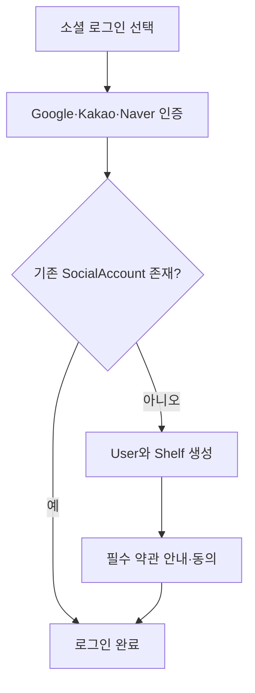
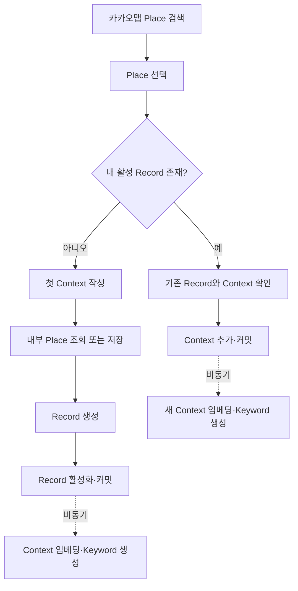
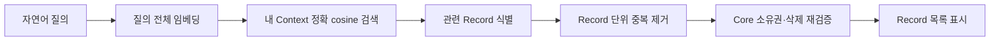
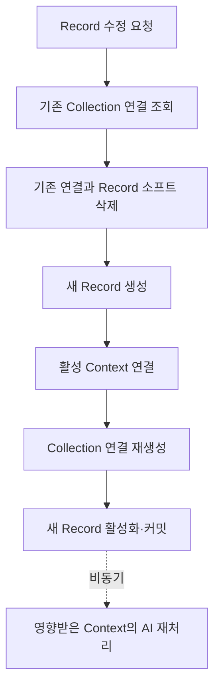
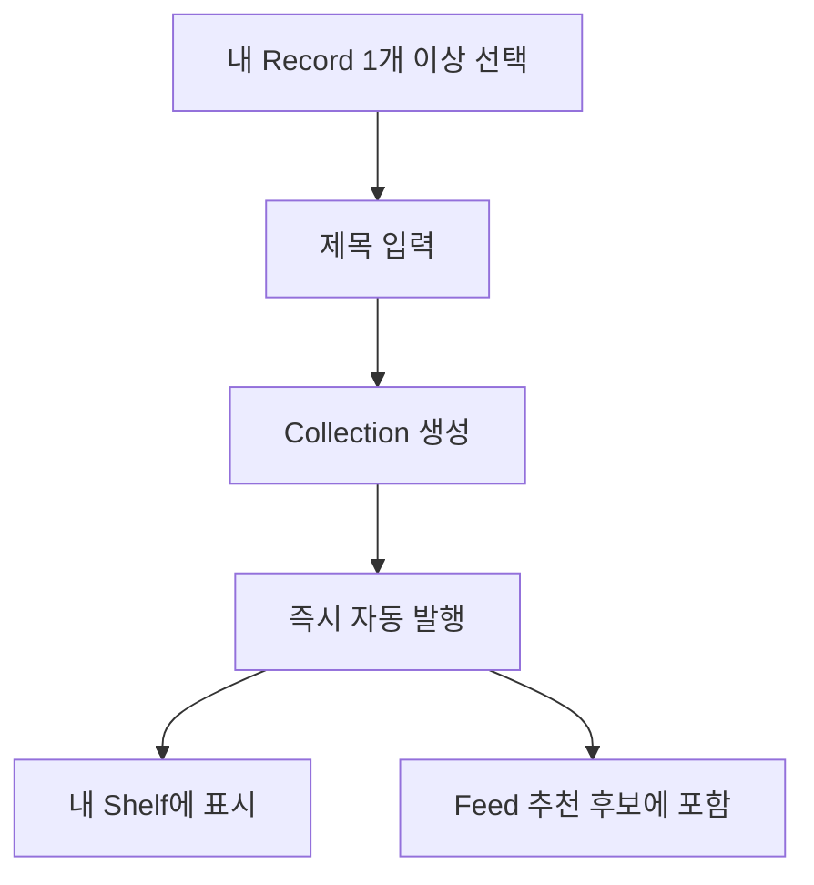
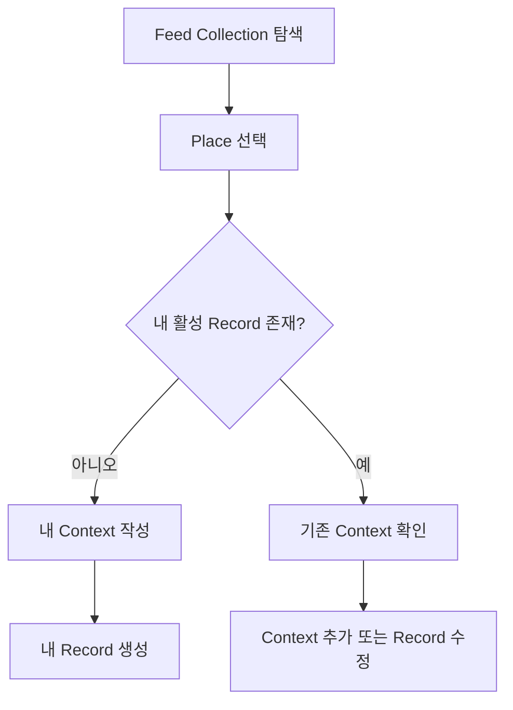
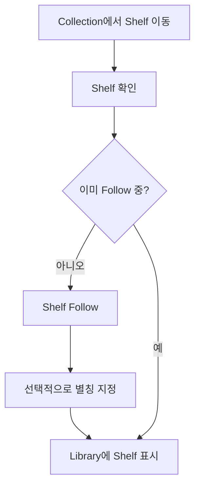
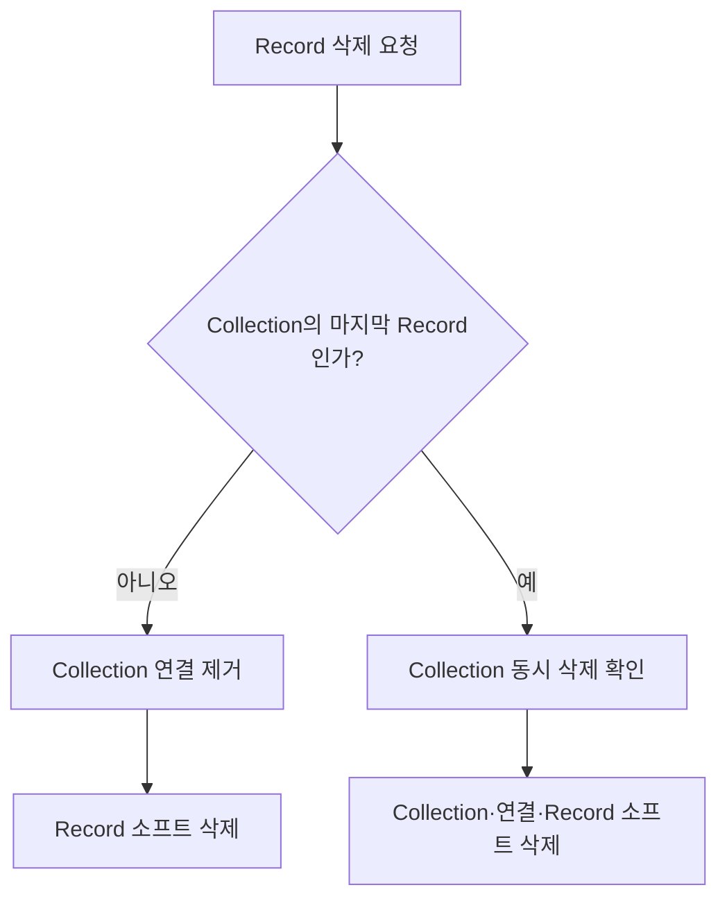

# PinLog 유저플로우

## 1. 가입과 로그인

## 2. Place 저장과 Record 생성

AI 처리는 커밋 이후 비동기로 진행하며 Record 활성화를 지연시키지 않습니다. 완료 전에는 Keyword가 비어 있을 수 있습니다.

## 3. AI 자연어 검색

## 4. Record 수정

## 5. Collection 생성과 발행

## 6. Feed에서 Place 가져오기

다른 사용자의 Context 원문은 이 흐름에 포함되지 않습니다.

## 7. Shelf Follow

## 8. 삭제 흐름

